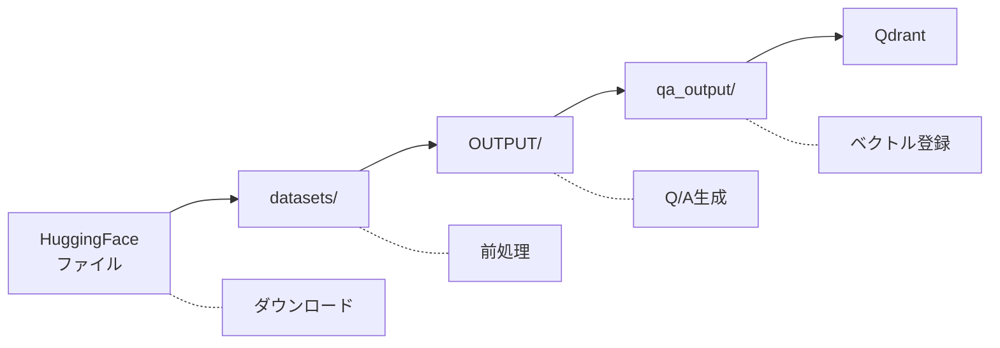
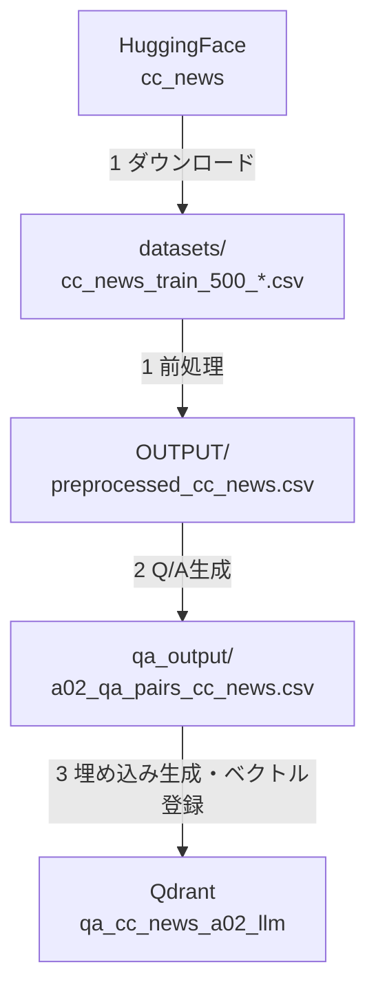

# rag_qa_pair_qdrant.py 操作マニュアル

本ドキュメントは、RAG Q&A生成・Qdrant管理 Streamlit アプリケーション（`rag_qa_pair_qdrant.py`）の画面説明と操作方法を解説します。

## 目次

- [1. はじめに](#1-はじめに)
  - [1.1 システム概要](#11-システム概要)
  - [1.2 動作要件・依存サービス](#12-動作要件依存サービス)
  - [1.3 起動方法](#13-起動方法)
- [2. 画面構成と基本操作](#2-画面構成と基本操作)
  - [2.1 サイドバーメニュー](#21-サイドバーメニュー)
  - [2.2 データフロー](#22-データフロー)
- [3. 📖 説明（System Explanation）](#3--説明system-explanation)
  - [3.1 画面概要](#31-画面概要)
  - [3.2 データフロー図の見方](#32-データフロー図の見方)
  - [3.3 ディレクトリ構造](#33-ディレクトリ構造)
  - [3.4 実行コマンド早見表](#34-実行コマンド早見表)
- [4. 📥 RAGデータダウンロード](#4--ragデータダウンロード)
  - [4.1 画面概要](#41-画面概要)
  - [4.2 データソースの選択](#42-データソースの選択)
  - [4.3 処理オプション設定](#43-処理オプション設定)
  - [4.4 ダウンロード・前処理の実行](#44-ダウンロード前処理の実行)
  - [4.5 処理結果の確認](#45-処理結果の確認)
- [5. 🤖 Q/A生成](#5--qa生成)
  - [5.1 画面概要](#51-画面概要)
  - [5.2 入力ソースの選択](#52-入力ソースの選択)
  - [5.3 Q/A生成設定](#53-qa生成設定)
  - [5.4 Q/A生成の実行](#54-qa生成の実行)
  - [5.5 生成結果の確認](#55-生成結果の確認)
- [6. 🗄️ Qdrant登録](#6-️-qdrant登録)
  - [6.1 画面概要](#61-画面概要)
  - [6.2 操作モード](#62-操作モード)
  - [6.3 Qdrant接続設定](#63-qdrant接続設定)
  - [6.4 登録処理の実行](#64-登録処理の実行)
  - [6.5 登録結果の確認](#65-登録結果の確認)
- [7. 🔍 Show-Qdrant](#7--show-qdrant)
  - [7.1 画面概要](#71-画面概要)
  - [7.2 接続状態の確認](#72-接続状態の確認)
  - [7.3 コレクション一覧](#73-コレクション一覧)
  - [7.4 データソース情報](#74-データソース情報)
  - [7.5 詳細データの表示・エクスポート](#75-詳細データの表示エクスポート)
- [8. 🔎 Qdrant検索](#8--qdrant検索)
  - [8.1 画面概要](#81-画面概要)
  - [8.2 検索設定](#82-検索設定)
  - [8.3 検索クエリの入力](#83-検索クエリの入力)
  - [8.4 検索結果の表示](#84-検索結果の表示)
  - [8.5 AI応答生成](#85-ai応答生成)
- [9. トラブルシューティング](#9-トラブルシューティング)
  - [9.1 Qdrant接続エラー](#91-qdrant接続エラー)
  - [9.2 Celeryワーカーの問題](#92-celeryワーカーの問題)
  - [9.3 よくあるエラーと対処法](#93-よくあるエラーと対処法)
- [付録](#付録)
  - [A. コマンドリファレンス](#a-コマンドリファレンス)
  - [B. データセット一覧](#b-データセット一覧)
  - [C. 出力ファイル一覧](#c-出力ファイル一覧)

---

## 1. はじめに

### 1.1 システム概要

本アプリケーションは、RAG（Retrieval-Augmented Generation）システムのための統合ツールです。以下の機能を提供します：

- **データセット取得**: HuggingFaceまたはローカルファイルからデータをダウンロード・前処理
- **Q/Aペア自動生成**: OpenAI APIを使用してドキュメントからQ&Aペアを自動生成
- **ベクトルDB登録**: 生成したQ&AペアをQdrantベクトルデータベースに登録
- **セマンティック検索**: 登録データに対する意味検索とAI応答生成

### 1.2 動作要件・依存サービス


| サービス       | 用途                           | デフォルトURL         |
| -------------- | ------------------------------ | --------------------- |
| **OpenAI API** | Q/A生成・埋め込み生成          | API Key必須           |
| **Qdrant**     | ベクトルデータベース           | http://localhost:6333 |
| **Redis**      | Celeryブローカー（並列処理時） | localhost:6379        |

### 1.3 起動方法

```bash
# 基本起動
streamlit run rag_qa_pair_qdrant.py --server.port=8500

# 事前準備（必要な場合）
# 1. Qdrantサーバー起動
docker-compose -f docker-compose/docker-compose.yml up -d

# 2. Celeryワーカー起動（Q/A並列生成時）
redis-cli FLUSHDB && ./start_celery.sh restart -w 24

# 3. Flower監視（任意）
celery -A celery_config flower --port=5555
```

---

## 2. 画面構成と基本操作

### 2.1 サイドバーメニュー

アプリケーション左側のサイドバーから、6つの機能画面を切り替えます。

[画面キャプチャ: サイドバーメニュー]


| メニュー                 | 機能概要                                                |
| ------------------------ | ------------------------------------------------------- |
| 📖 説明                  | システムのデータフロー・ディレクトリ構造を表示          |
| 📥 RAGデータダウンロード | HuggingFaceまたはローカルファイルからデータ取得・前処理 |
| 🤖 Q/A生成               | OpenAI APIによるQ&Aペア自動生成                         |
| 🗄️ Qdrant登録          | Q&AペアをQdrantベクトルDBに登録                         |
| 🔍 Show-Qdrant           | Qdrantコレクション内容の閲覧                            |
| 🔎 Qdrant検索            | セマンティック検索によるQ&A検索                         |

### 2.2 データフロー



---

## 3. 📖 説明（System Explanation）

### 3.1 画面概要

システム全体のデータフロー、処理ステップ、ディレクトリ構造を確認できる画面です。

[画面キャプチャ: 説明画面全体]


### 3.2 データフロー図の見方

CC-Newsデータセットを例としたデータフロー図が表示されます：



### 3.3 ディレクトリ構造


| ディレクトリ | 内容                                     |
| ------------ | ---------------------------------------- |
| `datasets/`  | ダウンロードした生データ                 |
| `OUTPUT/`    | 前処理済みデータ（`preprocessed_*.csv`） |
| `qa_output/` | 生成Q&Aペア（`a02_qa_pairs_*.csv`）      |

### 3.4 実行コマンド早見表

画面下部の「実行コマンド早見表」セクションで、各データセット向けのコマンド例を展開表示できます：

- 📰 CC-News データセット
- 📰 Livedoor データセット
- 📄 カスタムファイル（アップロード）

---

## 4. 📥 RAGデータダウンロード

### 4.1 画面概要

HuggingFaceデータセットまたはローカルファイルをダウンロード・前処理してOUTPUT/フォルダに保存する画面です。

[画面キャプチャ: RAGデータダウンロード画面全体]


### 4.2 データソースの選択

サイドバーの「データソース選択」で入力元を選びます。

#### HuggingFaceデータセット

[画面キャプチャ: データセット選択部分]


| データセット       | 説明                                  | デフォルトサンプル数 |
| ------------------ | ------------------------------------- | -------------------- |
| 🌐 Wikipedia日本語 | Wikipedia日本語版                     | 1,000件              |
| 🌏 CC100日本語     | Webテキスト（日本語）                 | 1,000件              |
| 📰 CC-News英語     | CC-News英語ニュース                   | 500件                |
| 📰 Livedoor        | Livedoorニュースコーパス（9カテゴリ） | 7,376件              |

#### ローカルファイルアップロード

[画面キャプチャ: ファイルアップロード部分]


対応形式：CSV, TXT, JSON, JSONL

- `question`, `answer` カラムがある場合 → Q/Aデータとして `qa_output/` に保存
- ない場合 → テキストデータとして `OUTPUT/` に保存

### 4.3 処理オプション設定

[画面キャプチャ: 処理オプション部分]


| オプション     | 説明                         | デフォルト               |
| -------------- | ---------------------------- | ------------------------ |
| サンプル数     | ダウンロードするデータ件数   | データセットにより異なる |
| 最小テキスト長 | この長さ未満のテキストを除外 | 50文字                   |
| 重複を除去     | 完全に同じテキストを除外     | ON                       |

### 4.4 ダウンロード・前処理の実行

1. データソースを選択
2. 処理オプションを設定
3. **「🚀 ダウンロード＆前処理開始」** ボタンをクリック

[画面キャプチャ: 実行ボタン]


### 4.5 処理結果の確認

処理完了後、以下が表示されます：

- **処理ログ**: 各ステップの進捗状況
- **保存されたファイル**: 出力ファイルのパス
- **データプレビュー**: 最初の10件のデータ

[画面キャプチャ: 処理結果表示]


---

## 5. 🤖 Q/A生成

### 5.1 画面概要

既存データまたはローカルファイルからQ/Aペアを生成する画面です。内部的に `a02_make_qa_para.py` の機能を呼び出します。

[画面キャプチャ: Q/A生成画面全体]


### 5.2 入力ソースの選択

サイドバーの「入力ソース選択」で入力元を選びます。

- **🌐 データセット**: 事前定義されたデータセット（OUTPUT/の前処理済みデータを使用）
- **📁 ローカルファイル**: CSV/TXT/JSON/JSONLファイルをアップロード

### 5.3 Q/A生成設定

[画面キャプチャ: Q/A生成設定部分]


#### Celery並列処理設定


| 設定項目         | 説明                   | デフォルト |
| ---------------- | ---------------------- | ---------- |
| Celery並列処理   | 複数ワーカーで並列処理 | ON         |
| Celeryワーカー数 | 並列処理するワーカー数 | 24         |

#### バッチ・トークン設定


| 設定項目           | 説明                         | デフォルト |
| ------------------ | ---------------------------- | ---------- |
| バッチチャンク数   | 1回のAPIで処理するチャンク数 | 3          |
| 最大ドキュメント数 | 処理する最大ドキュメント数   | 100        |
| 最小トークン数     | 統合対象の最小トークン数     | 150        |
| 最大トークン数     | 統合後の最大トークン数       | 400        |
| チャンク統合       | 小さいチャンクを統合         | ON         |

#### モデル・分析設定


| 設定項目       | 説明                       | デフォルト  |
| -------------- | -------------------------- | ----------- |
| カバレージ閾値 | カバレージ判定の類似度閾値 | 0.58        |
| モデル         | Q/A生成に使用するモデル    | gpt-4o-mini |
| カバレージ分析 | Q/Aペアのカバレージを分析  | ON          |

### 5.4 Q/A生成の実行

1. 入力ソースを選択
2. Q/A生成設定を調整
3. **「🚀 Q/A生成開始」** ボタンをクリック

[画面キャプチャ: Q/A生成実行ボタン]

**注意**: Celery並列処理を使用する場合、事前にCeleryワーカーを起動しておく必要があります。

```bash
redis-cli FLUSHDB && ./start_celery.sh restart -w 24
```

### 5.5 生成結果の確認

処理完了後、以下が表示されます：

- **プログレスバー**: タスク完了状況
- **処理ログ**: 各ステップの進捗（展開して確認）
- **生成結果**: Q/Aペア数、保存ファイルパス
- **カバレージ率**: カバレージ分析結果（オプション有効時）

[画面キャプチャ: Q/A生成結果]

出力ファイル:

- `qa_output/a02_qa_pairs_{dataset}.csv`
- `qa_output/a02_qa_pairs_{dataset}.json`

---

## 6. 🗄️ Qdrant登録

### 6.1 画面概要

`qa_output/*.csv` のQ/AデータをQdrantベクトルデータベースに登録する画面です。

[画面キャプチャ: Qdrant登録画面全体]


### 6.2 操作モード

サイドバーで操作モードを選択します。

#### 📊 全コレクション操作

既存のQdrantコレクション全体を管理します。

[画面キャプチャ: 全コレクション操作モード]

- コレクション一覧表示
- 総コレクション数・総ポイント数の確認
- 全コレクション削除（危険な操作）
- 各コレクションの詳細統計表示

#### 📄 個別CSV操作

特定のCSVファイルをQdrantに登録します。

[画面キャプチャ: 個別CSV操作モード]


| 設定項目       | 説明                             | デフォルト      |
| -------------- | -------------------------------- | --------------- |
| ファイル選択   | 登録するCSVファイル              | -               |
| コレクション名 | Qdrantコレクション名             | qa_{ファイル名} |
| 既存データ削除 | 既存コレクションを削除して再作成 | ON              |
| answerを含める | 埋め込み生成時にanswerも含める   | ON              |
| データ件数制限 | 0=無制限                         | 0               |

### 6.3 Qdrant接続設定

サイドバー上部でQdrant URLを設定します。

- デフォルト: `http://localhost:6333`

接続状態は画面上部に表示されます：

- ✅ 接続成功
- ❌ 接続エラー（起動コマンドを表示）

### 6.4 登録処理の実行

1. 操作モードを選択（個別CSV操作）
2. CSVファイルを選択
3. 登録設定を調整
4. **「🚀 Qdrantに登録」** ボタンをクリック

[画面キャプチャ: Qdrant登録実行]


処理ステップ：

1. CSVファイル読み込み
2. コレクション作成/再作成
3. 埋め込みベクトル生成（text-embedding-3-small）
4. Qdrantポイント構築
5. Qdrantアップサート

### 6.5 登録結果の確認

処理完了後、以下が表示されます：

- **処理ログ**: 各ステップの進捗
- **登録件数**: Qdrantに登録されたポイント数
- **統計情報**: コレクションの詳細情報（JSON形式）

[画面キャプチャ: Qdrant登録結果]


---

## 7. 🔍 Show-Qdrant

### 7.1 画面概要

Qdrant Vector Database の状態監視とデータ表示を行う画面です。

[画面キャプチャ: Show-Qdrant画面全体]


### 7.2 接続状態の確認

サイドバーで接続状態を確認・管理します。

[画面キャプチャ: 接続状態確認部分]


| 設定項目          | 説明                     |
| ----------------- | ------------------------ |
| 🐛 デバッグモード | 詳細情報を表示           |
| 🔄 自動更新       | 指定間隔で自動更新       |
| 間隔(秒)          | 自動更新間隔（5〜300秒） |

**「🔍 接続チェック実行」** ボタンで接続状態を確認できます。

### 7.3 コレクション一覧

メインエリアにQdrantのコレクション一覧が表示されます。

[画面キャプチャ: コレクション一覧]


| 列         | 説明           |
| ---------- | -------------- |
| Collection | コレクション名 |
| Points     | ポイント数     |
| Status     | ステータス     |

エクスポート機能：

- 📥 CSVダウンロード
- 📥 JSONダウンロード

### 7.4 データソース情報

各コレクションがどのファイルから構成されているかを確認できます。

[画面キャプチャ: データソース情報]


展開すると以下の情報が表示されます：

- 総ポイント数
- ソース数
- 各ソースファイルの割合・生成方法・ドメイン

### 7.5 詳細データの表示・エクスポート

「コレクション詳細データ」セクションで、特定コレクションの詳細を確認できます。

[画面キャプチャ: コレクション詳細データ]


1. コレクションを選択
2. 表示件数を設定
3. **「📊 詳細情報を表示」** または **「🔍 ポイントデータを取得」** をクリック

詳細情報：

- ベクトル数
- ポイント数
- インデックス済み数
- ステータス
- ベクトル次元・距離計算方式

---

## 8. 🔎 Qdrant検索

### 8.1 画面概要

Qdrantベクトルデータベースを使用した意味検索を行う画面です。

[画面キャプチャ: Qdrant検索画面全体]


### 8.2 検索設定

サイドバーで検索設定を行います。

[画面キャプチャ: 検索設定部分]


| 設定項目            | 説明                   | デフォルト |
| ------------------- | ---------------------- | ---------- |
| コレクション        | 検索対象のコレクション | -          |
| 検索結果数（Top-K） | 返す検索結果の数       | 5          |
| 🐛 デバッグモード   | 詳細情報を表示         | OFF        |

### 8.3 検索クエリの入力

メインエリアで検索クエリを入力します。

[画面キャプチャ: 検索入力部分]


1. テキストボックスに検索したい質問を入力
2. **「🔍 検索実行」** ボタンをクリック

### 8.4 検索結果の表示

検索結果がテーブル形式で表示されます。

[画面キャプチャ: 検索結果テーブル]


| 列     | 説明                         |
| ------ | ---------------------------- |
| スコア | コサイン類似度スコア（0〜1） |
| 質問   | 登録されているQ/Aの質問      |
| 回答   | 登録されているQ/Aの回答      |
| ソース | データソースファイル名       |

### 8.5 AI応答生成

最高スコアの結果に基づき、OpenAI GPT-4o-miniによるAI応答が生成されます。

[画面キャプチャ: AI応答生成部分]


表示内容：

- **最高スコアの結果**: スコア、ソース、質問、回答
- **AI応答**: ユーザーの質問と検索結果を踏まえた回答

「📝 プロンプト詳細」を展開すると、AIに送信されたプロンプトを確認できます。

---

## 9. トラブルシューティング

### 9.1 Qdrant接続エラー

**症状**: 「❌ Qdrantサーバーに接続できません」と表示される

**対処法**:

```bash
# Dockerで起動
docker run -p 6333:6333 qdrant/qdrant

# または docker-compose で起動
docker-compose -f docker-compose/docker-compose.yml up -d

# server.py で起動
python server.py
```

### 9.2 Celeryワーカーの問題

**症状**: Q/A生成が進まない、タイムアウトする

**対処法**:

```bash
# Redisキャッシュをクリアしてワーカー再起動
redis-cli FLUSHDB && ./start_celery.sh restart -w 24

# Flowerで状態確認（任意）
celery -A celery_config flower --port=5555
# ブラウザで http://localhost:5555 を開く
```

### 9.3 よくあるエラーと対処法


| エラー                 | 原因                             | 対処法                                 |
| ---------------------- | -------------------------------- | -------------------------------------- |
| `Connection refused`   | Qdrantが起動していない           | Qdrantを起動する                       |
| `collection not found` | コレクションが存在しない         | Qdrant登録でデータを登録               |
| `API key not found`    | OpenAI API Keyが設定されていない | `.env`ファイルに`OPENAI_API_KEY`を設定 |
| `timeout`              | 処理がタイムアウト               | ワーカー数を増やす、max_docsを減らす   |

---

## 付録

### A. コマンドリファレンス

```bash
# アプリケーション起動
streamlit run rag_qa_pair_qdrant.py --server.port=8500

# Qdrant起動
docker-compose -f docker-compose/docker-compose.yml up -d

# Celeryワーカー起動
./start_celery.sh restart -w 24

# Flower監視
celery -A celery_config flower --port=5555

# コマンドラインでQ/A生成
python a02_make_qa_para.py \
  --dataset cc_news \
  --use-celery \
  --celery-workers 24 \
  --model gpt-4o-mini \
  --max-docs 100

# コマンドラインでQdrant登録
python a42_qdrant_registration.py --recreate --include-answer
```

### B. データセット一覧


| データセット名  | HuggingFace ID      | 中間保存先                           | 最終出力先                              |
| --------------- | ------------------- | ------------------------------------ | --------------------------------------- |
| Wikipedia日本語 | wikimedia/wikipedia | `datasets/wikimedia_wikipedia_*.csv` | `OUTPUT/preprocessed_wikipedia_ja.csv`  |
| CC100日本語     | range3/cc100-ja     | `datasets/range3_cc100_ja_*.csv`     | `OUTPUT/preprocessed_japanese_text.csv` |
| CC-News英語     | cc_news             | `datasets/cc_news_*.csv`             | `OUTPUT/preprocessed_cc_news.csv`       |
| Livedoor        | 直接ダウンロード    | `datasets/livedoor/`                 | `OUTPUT/preprocessed_livedoor.csv`      |

### C. 出力ファイル一覧


| ディレクトリ | ファイル形式          | 説明                     |
| ------------ | --------------------- | ------------------------ |
| `datasets/`  | `*.csv`               | ダウンロードした生データ |
| `OUTPUT/`    | `preprocessed_*.csv`  | 前処理済みデータ         |
| `qa_output/` | `a02_qa_pairs_*.csv`  | Q/Aペア（CSV形式）       |
| `qa_output/` | `a02_qa_pairs_*.json` | Q/Aペア（JSON形式）      |
| `qa_output/` | `coverage_*.json`     | カバレージ分析結果       |

---

*本ドキュメントは `rag_qa_pair_qdrant.py` バージョンに基づいて作成されています。*
