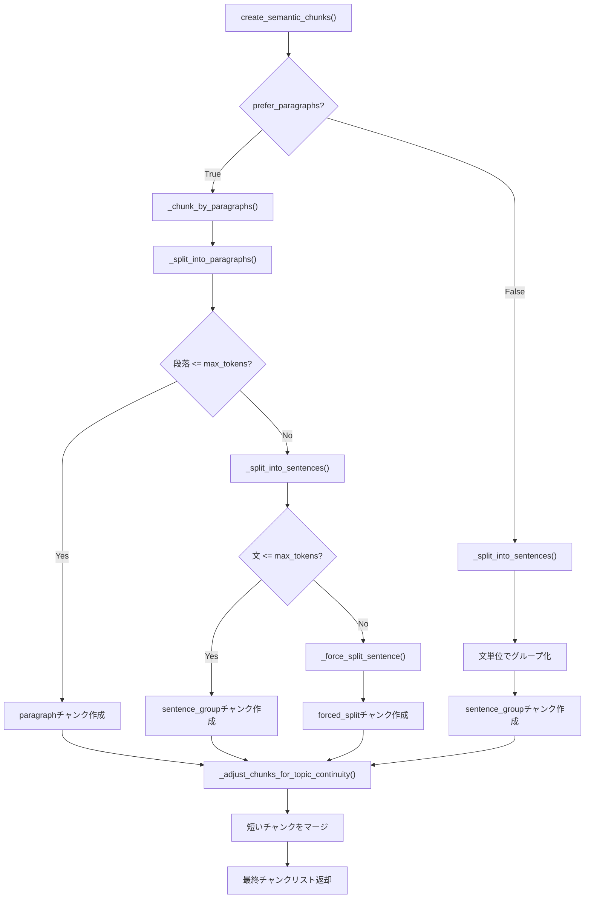
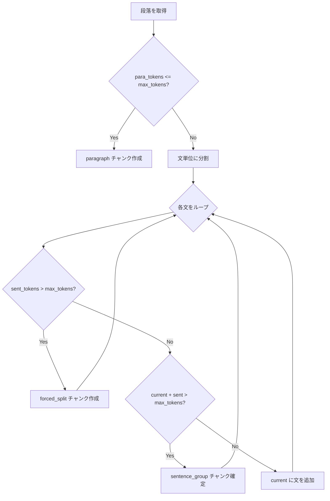

# チャンク分割技術ドキュメント

チャンク分割に使用しているクラス・関数を整理します。

## 目次

- [システムアーキテクチャ図](#システムアーキテクチャ図)
  - [a02_make_qa_para.py](#a02_make_qa_parapy)
  - [a03_rag_qa_coverage_improved.py](#a03_rag_qa_coverage_improvedpy)
  - [10_qa_optimized_hybrid_batch.py](#10_qa_optimized_hybrid_batchpy)
- [3ファイルのチャンク分割クラス・関数一覧](#3ファイルのチャンク分割クラス関数一覧)
  - [1. a02_make_qa_para.py](#1-a02_make_qa_parapy)
  - [2. a03_rag_qa_coverage_improved.py](#2-a03_rag_qa_coverage_improvedpy)
  - [3. a10_qa_optimized_hybrid_batch.py](#3-a10_qa_optimized_hybrid_batchpy)
- [比較表](#比較表)
- [共通の基盤: SemanticCoverageクラス](#共通の基盤-semanticcoverageクラス)
- [主要メソッド詳細解説](#主要メソッド詳細解説)
  - [1. _split_into_sentences() - インテリジェント文分割](#1-_split_into_sentences---インテリジェント文分割1713行目)
    - [概要](#概要)
    - [処理フロー図](#処理フロー図)
    - [日本語判定の仕組み](#日本語判定の仕組み)
    - [分割方法の優先順位](#分割方法の優先順位)
    - [なぜMeCabを優先するのか？](#なぜmecabを優先するのか)
    - [正規表現フォールバック](#正規表現フォールバック)
  - [2. _split_sentences_mecab() - MeCabによる文分割](#2-_split_sentences_mecab---mecabによる文分割1733行目)
    - [MeCabとは？](#mecabとは)
    - [処理フロー図](#処理フロー図-1)
    - [MeCabノードの構造](#mecabノードの構造)
    - [具体例：処理過程の追跡](#具体例処理過程の追跡)
    - [文末判定の記号](#文末判定の記号)
  - [3. _adjust_chunks_for_topic_continuity() - トピック連続性調整](#3-_adjust_chunks_for_topic_continuity---トピック連続性調整1767行目)
    - [目的](#目的)
    - [処理フロー図](#処理フロー図-2)
    - [パラメータ設計](#パラメータ設計)
    - [具体例](#具体例)
    - [タイプ管理](#タイプ管理)
  - [2つの文分割関数の関係図](#2つの文分割関数の関係図)
  - [設計思想まとめ](#設計思想まとめ)
- [実装コード解説](#実装コード解説)
  - [1. 定数と設定値](#1-定数と設定値)
  - [2. SemanticCoverage クラスの初期化](#2-semanticcoverage-クラスの初期化)
  - [3. create_semantic_chunks() - メインエントリポイント](#3-create_semantic_chunks---メインエントリポイント)
  - [4. 段落分割処理](#4-段落分割処理)
  - [5. 強制分割（長文対応）](#5-強制分割長文対応)
  - [6. 文分割の実装コード](#6-文分割の実装コード)
  - [7. トピック連続性調整の実装コード](#7-トピック連続性調整の実装コード)
  - [8. トークンベース分割との比較](#8-トークンベース分割との比較)

---

## システムアーキテクチャ図

[主関数] SemanticCoverage.create_semantic_chunks()



**処理の流れ:**

1. `prefer_paragraphs=True`（デフォルト）の場合、段落境界を最優先で分割
2. 段落が`max_tokens`を超える場合のみ文単位に再分割
3. 単一の文が`max_tokens`を超える場合は強制的にトークン単位で分割
4. 最後にトピック連続性を考慮して短いチャンクをマージ

#### a02_make_qa_para.py

- チャンク分割関連: [主関数] SemanticCoverage.create_semantic_chunks()
- create_semantic_chunks() (ローカル関数) - 487行目
- helper_rag_qa.SemanticCoverage クラスを使用 - 507行目
- SemanticCoverage.create_semantic_chunks() メソッドを内部で呼び出し
- merge_small_chunks() - 819行目

#### a03_rag_qa_coverage_improved.py

- チャンク分割関連:[主関数] SemanticCoverage.create_semantic_chunks()
- helper_rag_qa.SemanticCoverage クラスを直接インポート - 68行目
- SemanticCoverage.create_semantic_chunks() を使用 - 821行目
- process_with_improved_methods() 関数内で呼び出し

#### 10_qa_optimized_hybrid_batch.py

- チャンク分割関連:[主関数]
- helper_rag_qa.BatchHybridQAGenerator クラスを使用 - 140行目
- helper_rag_qa.OptimizedHybridQAGenerator クラスを使用 - 140行目
- 内部でSemanticCoverageを使用してチャンク分割を実行

#### これらの情報をまとめて、ユーザーに分かりやすく一覧表示します。

⏺ 3ファイルのチャンク分割に使用しているクラス・関数一覧

#### 1. a02_make_qa_para.py


| クラス/関数                               | 定義場所                                 | 概要                                           |
| ----------------------------------------- | ---------------------------------------- | ---------------------------------------------- |
| create_semantic_chunks()                  | ローカル関数 (487行目)                   | ラッパー関数。内部でSemanticCoverageを呼び出す |
| SemanticCoverage                          | helper_rag_qa.pyからインポート (505行目) | セマンティック分割のメインクラス               |
| SemanticCoverage.create_semantic_chunks() | helper_rag_qa.py (1513行目)              | 段落優先のセマンティック分割を実行             |
| merge_small_chunks()                      | ローカル関数 (819行目)                   | 小さすぎるチャンクを隣接チャンクと統合         |

チャンク分割フロー:

```
create_document_chunks() (756行目)
│   DataFrameの各行（文書）をループし、セマンティック分割を実行。
│   doc_id、chunk_idx等のメタデータを各チャンクに付与して返却。
│
└→ create_semantic_chunks() (487行目) [ローカル]
    │   SemanticCoverageクラスのラッパー関数。
    │   言語、max_tokens、chunk_id_prefixを設定してセマンティック分割を呼び出し、
    │   結果をa02用のフォーマット（id, text, tokens, type, sentences）に変換。
    │
    └→ SemanticCoverage.create_semantic_chunks() [helper_rag_qa.py:1513]
        │   メインのセマンティック分割関数。prefer_paragraphs=Trueで段落優先モード。
        │   文書を意味的なまとまりで分割し、トークン数制限を守りながらチャンク化。
        │
        ├→ _chunk_by_paragraphs() [helper_rag_qa.py:1623]
        │       段落（\n\n区切り）をベースにチャンク作成。
        │       段落がmax_tokens以下ならそのままparagraphチャンクに。
        │       超過する場合は文単位に再分割してsentence_groupチャンクに。
        │
        ├→ _split_into_sentences() [helper_rag_qa.py:1713]
        │       テキストを文単位に分割。日本語の場合はMeCabを優先使用。
        │       MeCab未インストール時は正規表現（。．？！等）にフォールバック。
        │       英語は正規表現（.!?）で分割。
        │
        └→ _adjust_chunks_for_topic_continuity() [helper_rag_qa.py:1767]
                短すぎるチャンク（min_tokens未満）を前のチャンクにマージ。
                マージ後300トークン以下なら統合、超えるなら独立チャンクとして保持。
                異なるtypeがマージされた場合はtype="merged"に更新。
```

---

2. a03_rag_qa_coverage_improved.py


| クラス/関数                               | 定義場所                                    | 概要                                          |
| ----------------------------------------- | ------------------------------------------- | --------------------------------------------- |
| SemanticCoverage                          | helper_rag_qa.pyから直接インポート (68行目) | セマンティック分割のメインクラス              |
| SemanticCoverage.create_semantic_chunks() | helper_rag_qa.py (1513行目)                 | 段落優先のセマンティック分割                  |
| analyze_chunk_complexity()                | ローカル関数 (254行目)                      | チャンクの複雑度を分析して適切なQ/A戦略を決定 |
| KeywordExtractor                          | ローカルクラス (95行目)                     | MeCab/正規表現によるキーワード抽出            |

チャンク分割フロー:
process_with_improved_methods() (798行目)
└→ SemanticCoverage.create_semantic_chunks() (821行目)
├→ prefer_paragraphs=True (段落優先モード)
├→ max_tokens=200
└→ min_tokens=50

---

3. a10_qa_optimized_hybrid_batch.py


| クラス/関数                | 定義場所                                 | 概要                            |
| -------------------------- | ---------------------------------------- | ------------------------------- |
| BatchHybridQAGenerator     | helper_rag_qa.pyからインポート (140行目) | バッチ処理版Q/A生成クラス       |
| OptimizedHybridQAGenerator | helper_rag_qa.pyからインポート (140行目) | 最適化版Q/A生成クラス（比較用） |
| 内部: SemanticCoverage     | BatchHybridQAGenerator内部で使用         | チャンク分割を内部で実行        |

チャンク分割フロー:　SemanticCoverage.create_semantic_chunks()
generate_batch_qa_from_dataset() (225行目)
└→ BatchHybridQAGenerator.generate_batch_hybrid_qa() (301行目)
└→ 内部でSemanticCoverageを使用してチャンク作成
└→ MeCab対応（日本語データセット時自動利用）

---

比較表


| ファイル                         | 主要クラス                      | チャンク分割方式           | 特徴                             |
| -------------------------------- | ------------------------------- | -------------------------- | -------------------------------- |
| a02_make_qa_para.py              | SemanticCoverage (ラッパー経由) | 段落優先セマンティック分割 | 小チャンク統合機能付き           |
| a03_rag_qa_coverage_improved.py  | SemanticCoverage (直接)         | 段落優先セマンティック分割 | 複雑度分析・品質スコアリング付き |
| a10_qa_optimized_hybrid_batch.py | BatchHybridQAGenerator          | 内部でSemanticCoverage使用 | バッチ処理最適化・キャッシュ対応 |

---

共通の基盤: helper_rag_qa.pyのSemanticCoverageクラス

全てのファイルが最終的にSemanticCoverage.create_semantic_chunks()を使用しています。主要メソッド:


| メソッド                              | 行番号 | 役割                             |
| ------------------------------------- | ------ | -------------------------------- |
| create_semantic_chunks()              | 1513   | メイン分割関数                   |
| _split_into_paragraphs()              | 1608   | 段落分割（\n\nで区切る）         |
| _chunk_by_paragraphs()                | 1623   | 段落ベースのチャンク化           |
| _split_into_sentences()               | 1713   | 文分割（MeCab/正規表現自動切替） |
| _split_sentences_mecab()              | 1733   | MeCabによる日本語文分割          |
| _force_split_sentence()               | 1685   | 長文の強制分割（最終手段）       |
| _adjust_chunks_for_topic_continuity() | 1767   | トピック連続性の調整             |

---

## 主要メソッド詳細解説

以下では、SemanticCoverageクラスの主要メソッドについて、設計思想と実装詳細を解説します。

---

### 1. `_split_into_sentences()` - インテリジェント文分割（1713行目）

#### 概要

テキストを**文単位**に分割する関数。言語（日本語 or 英語）を自動判定し、最適な分割方法を選択します。

#### 処理フロー図

```
入力テキスト
     │
     ▼
┌─────────────────────────────────────┐
│  _split_into_sentences()            │
│  ┌───────────────────────────────┐  │
│  │ 日本語判定（先頭100文字）     │  │
│  └───────────────────────────────┘  │
│       │                             │
│   日本語？ ─── NO ─────────────────────────────┐
│       │YES                          │          │
│       ▼                             │          │
│  MeCab利用可？ ─ NO ───────────────────────────┤
│       │YES                          │          │
│       ▼                             │          ▼
│  _split_sentences_mecab()           │   正規表現で分割
│                                     │   (?<=[。．.!?])\s*
└─────────────────────────────────────┘
```

#### 日本語判定の仕組み

```python
is_japanese = bool(re.search(r'[\u3040-\u309F\u30A0-\u30FF\u4E00-\u9FFF]', text[:100]))
```

| Unicode範囲 | 文字種 | 例 |
|------------|--------|-----|
| `\u3040-\u309F` | ひらがな | あ、い、う、を、ん |
| `\u30A0-\u30FF` | カタカナ | ア、イ、ウ、ヲ、ン |
| `\u4E00-\u9FFF` | 漢字 | 日、本、語 |

→ これらが**1文字でもあれば**日本語と判定（先頭100文字で高速判定）

#### 分割方法の優先順位

```
┌────────────────────────────────────────────────┐
│           分割方法の優先順位                    │
├────────────────────────────────────────────────┤
│ 1. MeCab (日本語)  ← 形態素解析で高精度        │
│    ↓ 失敗時                                    │
│ 2. 正規表現        ← 軽量・フォールバック      │
└────────────────────────────────────────────────┘
```

#### なぜMeCabを優先するのか？

正規表現だけだと誤分割が起きるケースがあります：

```
【正規表現の弱点】
「3.14は円周率です。」→ 「3」「14は円周率です。」（誤分割！）
「Yahoo!は検索サイトです。」→ 「Yahoo」「は検索サイトです。」（誤分割！）

【MeCabなら正しく分割】
「3.14は円周率です。」→ 「3.14は円周率です。」（正しい）
```

#### 正規表現フォールバック

```python
sentences = re.split(r'(?<=[。．.!?])\s*', text)
```

| パターン | 意味 |
|---------|------|
| `(?<=...)` | 肯定後読み（マッチ位置の直前がこのパターン） |
| `[。．.!?]` | 句点・ピリオド・感嘆符・疑問符のいずれか |
| `\s*` | 0個以上の空白 |

→ 句読点の**直後**で分割（句読点自体は前の文に残る）

---

### 2. `_split_sentences_mecab()` - MeCabによる文分割（1733行目）

#### MeCabとは？

**MeCab**は、日本語の形態素解析器です。テキストを最小意味単位（形態素）に分解します。

```
入力: 「私は東京に住んでいます。」
　↓ MeCab解析
出力: 私 / は / 東京 / に / 住ん / で / い / ます / 。
      ↑各形態素に分解
```

#### 処理フロー図

```
入力テキスト: 「日本語は難しい。でも面白い！」
              │
              ▼
         ┌─────────┐
         │ MeCab   │
         │ Tagger  │
         └─────────┘
              │ parseToNode()
              ▼
    ┌─────────────────────────────────────┐
    │ ノードチェーン（形態素の連結リスト）│
    │                                     │
    │ [日本語]→[は]→[難しい]→[。]→       │
    │ [でも]→[面白い]→[！]→[EOS]         │
    └─────────────────────────────────────┘
              │
              ▼ ノードを順次処理
         ┌─────────────────┐
         │ 文末記号を検出  │
         │ 。．？！?!      │
         └─────────────────┘
              │
              ▼
    出力: ["日本語は難しい。", "でも面白い！"]
```

#### MeCabノードの構造

```
┌──────────────────────────────────────────┐
│  MeCab.Node オブジェクト                 │
├──────────────────────────────────────────┤
│  .surface  = "東京"        (表層形)      │
│  .feature  = "名詞,固有名詞,地域,..."    │
│  .next     = 次のノード                  │
│  .prev     = 前のノード                  │
└──────────────────────────────────────────┘
         │
         ▼ node.next
┌──────────────────────────────────────────┐
│  .surface  = "に"                        │
│  .feature  = "助詞,格助詞,..."           │
│  ...                                     │
└──────────────────────────────────────────┘
```

#### 具体例：処理過程の追跡

入力: `「今日は天気が良い。明日も晴れるだろう。」`

```
MeCab解析結果（ノードチェーン）:
  今日 → は → 天気 → が → 良い → 。 → 明日 → も → 晴れる → だろう → 。

処理過程:
┌───────┬────────────────────────────────────┬─────────────────────────┐
│ステップ│ current_sentence                   │ sentences               │
├───────┼────────────────────────────────────┼─────────────────────────┤
│ 1     │ ["今日"]                           │ []                      │
│ 2     │ ["今日", "は"]                     │ []                      │
│ 3     │ ["今日", "は", "天気"]             │ []                      │
│ ...   │ ...                                │ []                      │
│ 6     │ ["今日","は","天気","が","良い","。"] │ []                    │
│       │ ↑「。」検出→文確定                 │                         │
│ 7     │ []  (リセット)                     │ ["今日は天気が良い。"]  │
│ 8     │ ["明日"]                           │ ["今日は天気が良い。"]  │
│ ...   │ ...                                │                         │
│ 11    │ ["明日","も","晴れる","だろう","。"] │                        │
│       │ ↑「。」検出→文確定                 │                         │
│ 12    │ []                                 │ ["今日は天気が良い。",  │
│       │                                    │  "明日も晴れるだろう。"]│
└───────┴────────────────────────────────────┴─────────────────────────┘

最終出力: ["今日は天気が良い。", "明日も晴れるだろう。"]
```

#### 文末判定の記号

```python
if surface in ['。', '．', '？', '！', '?', '!']:
```

| 記号 | 用途 |
|------|------|
| `。` | 和文句点 |
| `．` | 全角ピリオド |
| `？` `?` | 疑問符（全角/半角） |
| `！` `!` | 感嘆符（全角/半角） |

---

### 3. `_adjust_chunks_for_topic_continuity()` - トピック連続性調整（1767行目）

#### 目的

短すぎるチャンクを前のチャンクにマージし、意味的なまとまりを維持します。

#### 処理フロー図

```
入力チャンク列
[チャンク1: 150トークン] [チャンク2: 30トークン] [チャンク3: 180トークン]
                              ↑
                         min_tokens(50)未満
                              │
                              ▼
                    前のチャンクとマージ検討
                              │
              ┌───────────────┴───────────────┐
              ▼                               ▼
    結合後 <= 300トークン？           結合後 > 300トークン？
              │                               │
              ▼                               ▼
         マージ実行                    独立チャンク維持
              │
              ▼
[チャンク1+2: 180トークン] [チャンク3: 180トークン]
```

#### パラメータ設計

| パラメータ | 値 | 理由 |
|-----------|-----|------|
| `min_tokens` | 50 | これより短いと文脈不足でQ&A生成品質低下 |
| マージ上限 | 300 | embedding model の最適入力長を考慮 |

#### 具体例

```
【マージ前】
チャンク1: "機械学習は人工知能の一分野です。" (15トークン)
チャンク2: "データから学習します。" (8トークン)  ← 短すぎる
チャンク3: "深層学習はニューラルネットワークを使用した..." (120トークン)

【マージ後】
チャンク1+2: "機械学習は人工知能の一分野です。データから学習します。" (23トークン)
チャンク3: "深層学習はニューラルネットワークを使用した..." (120トークン)
```

#### タイプ管理

異なるタイプのチャンクがマージされた場合、`type="merged"`に更新：

```python
if prev_chunk.get("type") != chunk.get("type"):
    prev_chunk["type"] = "merged"
```

---

### 2つの文分割関数の関係図

```
create_semantic_chunks()     # チャンク生成のメイン関数
        │
        ▼
_split_into_sentences()      # 文分割（ルーティング）
        │
        ├── 日本語 & MeCab可 ───▶ _split_sentences_mecab()
        │                              │
        │                              ▼
        │                         MeCab形態素解析
        │                         句点で文を区切る
        │
        └── 英語 or MeCab不可 ──▶ 正規表現で分割
                                       │
                                       ▼
                                  (?<=[。．.!?])\s*

        │
        ▼
_adjust_chunks_for_topic_continuity()  # 短いチャンクをマージ
```

---

### 設計思想まとめ

| 観点 | 設計 | 理由 |
|------|------|------|
| **言語自動判定** | 先頭100文字でひらがな/カタカナ/漢字を検出 | 高速かつ十分な精度 |
| **MeCab優先** | 日本語ならMeCabを第一選択 | 形態素解析により「3.14」等の誤分割を防止 |
| **フォールバック** | MeCab失敗時は正規表現に切替 | MeCab未インストール環境でも動作 |
| **句読点保持** | 分割後も句点を文末に残す | 文の完全性を維持 |
| **最後の文処理** | ループ後に残りを追加 | 文末句点がないテキストにも対応 |
| **短チャンクマージ** | min_tokens未満は前チャンクに統合 | 意味的まとまりと品質確保 |

---

## 実装コード解説

以下では、チャンク分割の核心となる実装コードを解説します。

### 1. 定数と設定値

チャンク分割で使用するデフォルト値です。これらはQ/A生成品質とEmbeddingモデルの最適入力長を考慮して設計されています。

**ソース: `helper_text.py:27-33`**

```python
# デフォルトのチャンクサイズ設定
DEFAULT_CHUNK_SIZE = 300      # トークン数（Embeddingモデルの最適入力長）
DEFAULT_CHUNK_OVERLAP = 50    # オーバーラップトークン数（文脈の連続性確保）
DEFAULT_MIN_CHUNK_SIZE = 50   # 最小チャンクサイズ（Q/A生成に必要な最低限の文脈）

# デフォルトの埋め込みモデル用エンコーディング
DEFAULT_ENCODING = "cl100k_base"  # GPT-4/text-embedding-3 用トークナイザ
```

| 定数 | 値 | 設計根拠 |
|-----|-----|---------|
| `DEFAULT_CHUNK_SIZE` | 300 | text-embedding-3-small の推奨入力長（512以下）を考慮 |
| `DEFAULT_CHUNK_OVERLAP` | 50 | チャンク境界での文脈喪失を防止 |
| `DEFAULT_MIN_CHUNK_SIZE` | 50 | Q/A生成に最低限必要な文脈量 |
| `DEFAULT_ENCODING` | cl100k_base | GPT-4系/Embedding系モデル共通のトークナイザ |

---

### 2. SemanticCoverage クラスの初期化

MeCabの利用可能性をチェックし、環境に応じて最適な文分割方法を選択します。

**ソース: `helper_rag_qa.py:1502-1511`**

```python
def _check_mecab_availability(self) -> bool:
    """MeCabの利用可能性をチェック"""
    try:
        import MeCab
        # 実際にインスタンス化して動作確認
        tagger = MeCab.Tagger()
        tagger.parse("テスト")
        return True
    except (ImportError, RuntimeError):
        return False
```

**ポイント:**
- `import MeCab` だけでなく、`tagger.parse()` まで実行して動作確認
- 辞書が見つからない場合の `RuntimeError` もキャッチ
- 結果は `self.mecab_available` に保存され、以降の分割処理で参照

---

### 3. create_semantic_chunks() - メインエントリポイント

セマンティックチャンク分割のメイン関数です。段落優先モード（`prefer_paragraphs=True`）がデフォルトです。

**ソース: `helper_rag_qa.py:1513-1606`**

```python
def create_semantic_chunks(self, document: str, max_tokens: int = 200, min_tokens: int = 50,
                           prefer_paragraphs: bool = True, verbose: bool = True) -> List[Dict]:
    """
    文書を意味的に区切られたチャンクに分割（段落優先のセマンティック分割）

    重要ポイント：
    1. 段落の境界で分割（最優先 - 筆者の意図したセマンティック境界）
    2. 文の境界で分割（意味の断絶を防ぐ）
    3. トピックの変化を検出
    4. 適切なサイズを維持（埋め込みモデルの制限内）

    Args:
        document: 分割対象の文書
        max_tokens: チャンクの最大トークン数（デフォルト: 200）
        min_tokens: チャンクの最小トークン数（デフォルト: 50）
        prefer_paragraphs: 段落ベースの分割を優先するか（デフォルト: True）
        verbose: 詳細な出力を行うか

    Returns:
        チャンク辞書のリスト（id, text, type, sentences等を含む）
    """

    # Step 1: 段落ベースの分割を試行（prefer_paragraphs=Trueの場合）
    if prefer_paragraphs:
        para_chunks = self._chunk_by_paragraphs(document, max_tokens, min_tokens)

        # 段落ベースのチャンクを標準フォーマットに変換
        chunks = []
        for i, chunk in enumerate(para_chunks):
            chunk_text = chunk['text']
            sentences = self._split_into_sentences(chunk_text)
            chunks.append({
                "id"       : f"chunk_{i}",
                "text"     : chunk_text,
                "type"     : chunk['type'],       # paragraph, sentence_group, forced_split
                "sentences": sentences,
                "start_sentence_idx": 0,
                "end_sentence_idx"  : len(sentences) - 1
            })
    else:
        # 旧方式: 文単位で分割してグループ化
        sentences = self._split_into_sentences(document)
        # ... (文単位のグループ化処理)

    # Step 3: トピックの連続性を考慮した再調整
    chunks = self._adjust_chunks_for_topic_continuity(chunks, min_tokens)

    return chunks
```

**チャンクの `type` フィールド:**

| type | 説明 | 生成元 |
|------|------|-------|
| `paragraph` | 段落がそのままチャンクになった | `_chunk_by_paragraphs()` |
| `sentence_group` | 複数の文をグループ化 | `_chunk_by_paragraphs()` / 旧方式 |
| `forced_split` | 強制的にトークン分割 | `_force_split_sentence()` |
| `merged` | 異なるtypeがマージされた | `_adjust_chunks_for_topic_continuity()` |

---

### 4. 段落分割処理

#### 4.1 _split_into_paragraphs() - 段落単位分割

**ソース: `helper_rag_qa.py:1608-1621`**

```python
def _split_into_paragraphs(self, text: str) -> List[str]:
    """
    段落単位で分割（セマンティック分割の最優先レベル）

    段落は筆者が意図的に作った意味的なまとまりであり、
    最も重要なセマンティック境界となる
    """
    # 空行（\n\n）で段落を分割
    paragraphs = re.split(r'\n\s*\n', text)

    # 空白のみの段落を除外
    paragraphs = [p.strip() for p in paragraphs if p.strip()]

    return paragraphs
```

**正規表現 `\n\s*\n` の解説:**

| パターン | 意味 |
|---------|------|
| `\n` | 改行 |
| `\s*` | 0個以上の空白（空行内のスペース/タブを許容） |
| `\n` | 改行 |

→ 「空行」で段落を分割（Markdownの段落規則と同様）

#### 4.2 _chunk_by_paragraphs() - 段落ベースチャンク化

**ソース: `helper_rag_qa.py:1623-1683`**

```python
def _chunk_by_paragraphs(self, text: str, max_tokens: int = 200, min_tokens: int = 50) -> List[Dict[str, Any]]:
    """
    段落単位でチャンク化（セマンティック最優先）

    段落をベースにチャンクを作成し、トークン数制限を考慮する。
    段落が大きすぎる場合は文単位に分割する。
    """
    paragraphs = self._split_into_paragraphs(text)
    chunks = []

    for para in paragraphs:
        para_tokens = len(self.tokenizer.encode(para))

        if para_tokens <= max_tokens:
            # ケース1: 段落がそのままチャンクとして適切
            chunks.append({'text': para, 'type': 'paragraph'})
        else:
            # ケース2: 段落が大きすぎる → 文単位に分割
            sentences = self._split_into_sentences(para)
            current_chunk = []
            current_tokens = 0

            for sent in sentences:
                sent_tokens = len(self.tokenizer.encode(sent))

                if sent_tokens > max_tokens:
                    # ケース2a: 単一文が上限超過 → 強制分割
                    if current_chunk:
                        chunks.append({'text': ''.join(current_chunk), 'type': 'sentence_group'})
                        current_chunk = []
                        current_tokens = 0

                    # 強制分割を実施
                    forced_chunks = self._force_split_sentence(sent, max_tokens)
                    chunks.extend(forced_chunks)

                elif current_tokens + sent_tokens > max_tokens:
                    # ケース2b: 追加すると上限超過 → 現在のチャンクを確定
                    if current_chunk:
                        chunks.append({'text': ''.join(current_chunk), 'type': 'sentence_group'})
                    current_chunk = [sent]
                    current_tokens = sent_tokens

                else:
                    # ケース2c: 追加可能
                    current_chunk.append(sent)
                    current_tokens += sent_tokens

            # 残りを確定
            if current_chunk:
                chunks.append({'text': ''.join(current_chunk), 'type': 'sentence_group'})

    return chunks
```

**分岐フローチャート:**



---

### 5. 強制分割（長文対応）

単一の文が `max_tokens` を超える場合の最終手段です。意味的な境界を無視し、トークン単位で強制分割します。

**ソース: `helper_rag_qa.py:1685-1711`**

```python
def _force_split_sentence(self, sentence: str, max_tokens: int = 200) -> List[Dict[str, Any]]:
    """
    単一文が上限超過の場合に強制的に分割（最終手段）

    セマンティック境界を無視して、トークン数ベースで強制的に分割する。
    これは意味的な一貫性を犠牲にするが、処理上の制約を守るために必要。
    """
    # トークンレベルで分割
    tokens = self.tokenizer.encode(sentence)
    forced_chunks = []

    for i in range(0, len(tokens), max_tokens):
        chunk_tokens = tokens[i:i + max_tokens]
        chunk_text = self.tokenizer.decode(chunk_tokens)
        forced_chunks.append({
            'text': chunk_text,
            'type': 'forced_split'  # 強制分割であることを明示
        })

    return forced_chunks
```

**具体例:**

```
入力: "これは非常に長い文で、たくさんの情報を含んでおり、
      専門用語や技術的な説明が延々と続く...（500トークン）"

max_tokens=200 の場合:
  → チャンク1: "これは非常に長い文で..."  (200トークン, type='forced_split')
  → チャンク2: "専門用語や技術的な..."    (200トークン, type='forced_split')
  → チャンク3: "続く..."                  (100トークン, type='forced_split')
```

**注意:** `forced_split` チャンクはQ/A生成品質が低下する可能性があるため、ソースデータの前処理で長文を避けることが望ましい。

---

### 6. 文分割の実装コード

#### 6.1 _split_into_sentences() - 言語判定付き文分割

**ソース: `helper_rag_qa.py:1713-1731`**

```python
def _split_into_sentences(self, text: str) -> List[str]:
    """文単位で分割（言語自動判定・MeCab優先対応）"""

    # 日本語判定（最初の100文字で判定）
    is_japanese = bool(re.search(r'[\u3040-\u309F\u30A0-\u30FF\u4E00-\u9FFF]', text[:100]))

    if is_japanese and self.mecab_available:
        # 日本語の場合、MeCab利用を優先（セマンティック精度向上）
        try:
            sentences = self._split_sentences_mecab(text)
            if sentences:
                return sentences
        except Exception:
            pass  # フォールバック

    # 英語 or MeCab失敗時: 正規表現
    sentences = re.split(r'(?<=[。．.!?])\s*', text)
    sentences = [s.strip() for s in sentences if s.strip()]
    return sentences
```

#### 6.2 _split_sentences_mecab() - MeCab文分割

**ソース: `helper_rag_qa.py:1733-1765`**

```python
def _split_sentences_mecab(self, text: str) -> List[str]:
    """MeCabを使った文分割（日本語用）"""
    import MeCab

    tagger = MeCab.Tagger()
    node = tagger.parseToNode(text)

    sentences = []
    current_sentence = []

    while node:
        surface = node.surface  # 表層形（実際の文字列）

        if surface:
            current_sentence.append(surface)

            # 文末判定：句点（。）、疑問符（？）、感嘆符（！）
            if surface in ['。', '．', '？', '！', '?', '!']:
                sentence = ''.join(current_sentence).strip()
                if sentence:
                    sentences.append(sentence)
                current_sentence = []

        node = node.next  # 次の形態素へ

    # 最後の文を追加（句点なしで終わる場合）
    if current_sentence:
        sentence = ''.join(current_sentence).strip()
        if sentence:
            sentences.append(sentence)

    return sentences if sentences else []
```

---

### 7. トピック連続性調整の実装コード

**ソース: `helper_rag_qa.py:1767-1807`**

```python
def _adjust_chunks_for_topic_continuity(self, chunks: List[Dict], min_tokens: int = 50) -> List[Dict]:
    """
    トピックの連続性を考慮してチャンクを調整（最小トークン数対応）

    短すぎるチャンクを隣接チャンクとマージして意味的まとまりを維持する。
    """
    adjusted_chunks = []

    for i, chunk in enumerate(chunks):
        chunk_tokens = len(self.tokenizer.encode(chunk["text"]))

        # 最小トークン数以下の短いチャンクの場合
        if i > 0 and chunk_tokens < min_tokens:
            # 前のチャンクとマージを検討
            prev_chunk = adjusted_chunks[-1]
            combined_text = prev_chunk["text"] + " " + chunk["text"]
            combined_tokens = len(self.tokenizer.encode(combined_text))

            # マージしても最大トークン数（300）を超えない場合はマージ
            if combined_tokens < 300:
                # マージ実施
                prev_chunk["text"] = combined_text
                prev_chunk["sentences"].extend(chunk["sentences"])
                prev_chunk["end_sentence_idx"] = chunk["end_sentence_idx"]

                # typeの更新（異なるtypeがマージされた場合）
                if prev_chunk.get("type") != chunk.get("type"):
                    prev_chunk["type"] = "merged"

                continue  # このチャンクはマージ済みなのでスキップ

        adjusted_chunks.append(chunk)

    return adjusted_chunks
```

**マージ条件:**

| 条件 | チェック内容 |
|------|------------|
| 1 | `i > 0` - 最初のチャンクでない |
| 2 | `chunk_tokens < min_tokens` - 短すぎる |
| 3 | `combined_tokens < 300` - マージ後も上限以内 |

すべて満たす場合のみマージが実行される。

---

### 8. トークンベース分割との比較

`helper_text.py` にはシンプルなトークンベースの分割関数があります。SemanticCoverageとの違いを理解することで、用途に応じた選択ができます。

#### 8.1 split_into_chunks() - シンプル分割

**ソース: `helper_text.py:227-270`**

```python
def split_into_chunks(
    text: str,
    chunk_size: int = DEFAULT_CHUNK_SIZE,
    overlap: int = DEFAULT_CHUNK_OVERLAP,
    encoding_name: str = DEFAULT_ENCODING
) -> List[str]:
    """
    テキストをチャンクに分割（トークンベース）
    """
    if not text:
        return []

    encoding = tiktoken.get_encoding(encoding_name)
    tokens = encoding.encode(text)

    if len(tokens) <= chunk_size:
        return [text]

    chunks = []
    start = 0

    while start < len(tokens):
        end = start + chunk_size
        chunk_tokens = tokens[start:end]
        chunk_text = encoding.decode(chunk_tokens)
        chunks.append(chunk_text)

        # オーバーラップを考慮して次の開始位置を設定
        start = end - overlap

        if end >= len(tokens):
            break

    return chunks
```

#### 8.2 merge_small_chunks() - 小チャンク統合

**ソース: `helper_text.py:348-390`**

```python
def merge_small_chunks(
    chunks: List[dict],
    min_tokens: int = DEFAULT_MIN_CHUNK_SIZE,
    max_tokens: int = DEFAULT_CHUNK_SIZE * 2
) -> List[dict]:
    """
    小さいチャンクを統合
    """
    if not chunks:
        return []

    merged = []
    current = None

    for chunk in chunks:
        if current is None:
            current = chunk.copy()
            continue

        # 現在のチャンクが小さく、統合しても最大トークン数を超えない場合
        if current["tokens"] < min_tokens and current["tokens"] + chunk["tokens"] <= max_tokens:
            # 同じドキュメントのチャンクのみ統合
            if current["doc_id"] == chunk["doc_id"]:
                current["text"] = current["text"] + " " + chunk["text"]
                current["tokens"] = current["tokens"] + chunk["tokens"]
                current["id"] = f"{current['doc_id']}_merged_{current['chunk_idx']}_{chunk['chunk_idx']}"
                continue

        merged.append(current)
        current = chunk.copy()

    if current is not None:
        merged.append(current)

    return merged
```

#### 8.3 分割方式の比較表

| 項目 | SemanticCoverage | helper_text.split_into_chunks |
|------|------------------|------------------------------|
| **分割基準** | 段落 → 文 → トークン | トークンのみ |
| **意味的境界** | 考慮する | 考慮しない |
| **オーバーラップ** | なし（マージで対応） | あり（デフォルト50） |
| **言語対応** | 日本語(MeCab)/英語自動判定 | 言語非依存 |
| **用途** | Q/A生成向け高品質分割 | 汎用的な高速分割 |
| **処理速度** | 遅め | 速い |

**推奨使い分け:**

- **Q/A生成、RAG検索** → `SemanticCoverage.create_semantic_chunks()`
- **大量テキストの高速処理** → `split_into_chunks()`
- **既存チャンクの後処理** → `merge_small_chunks()`
