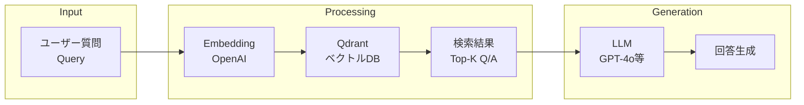
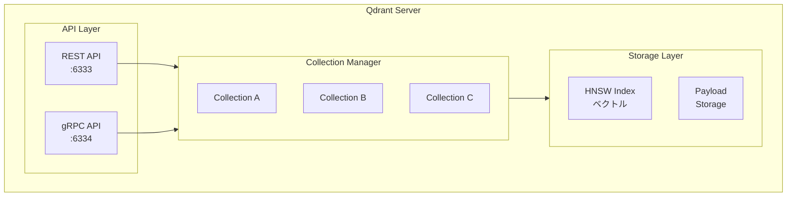
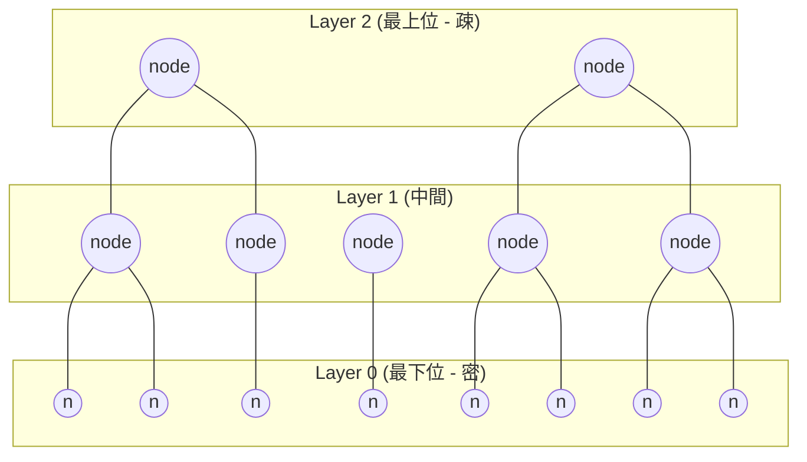
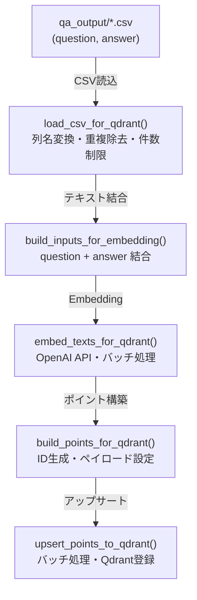
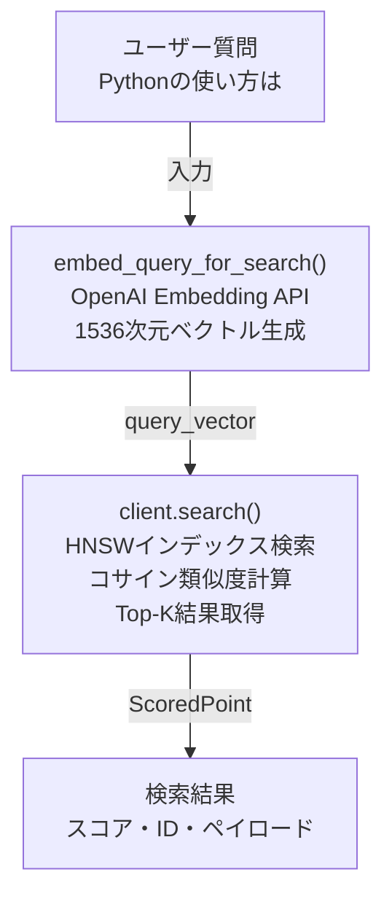
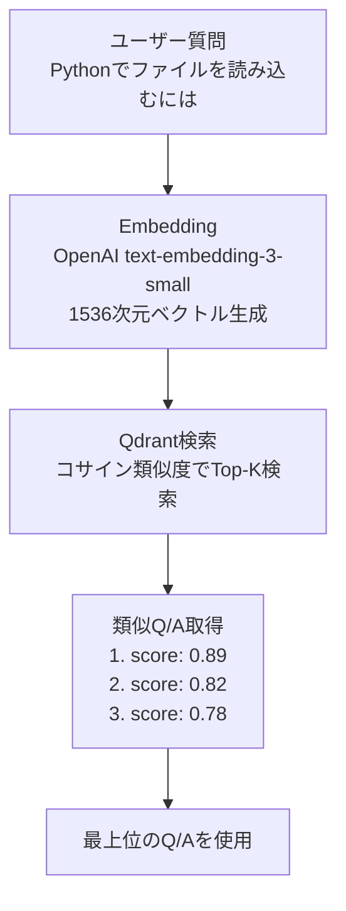
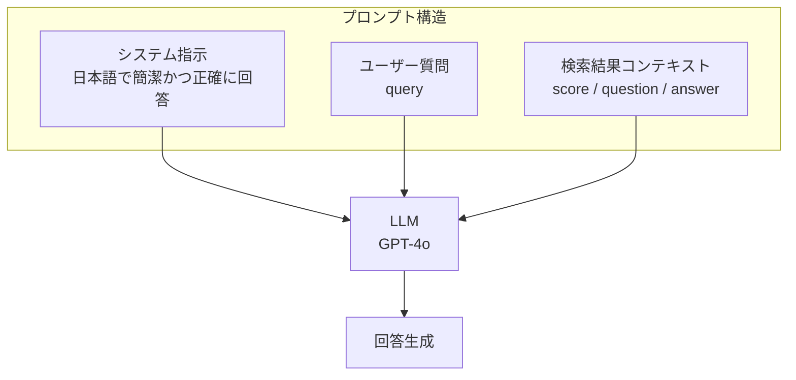
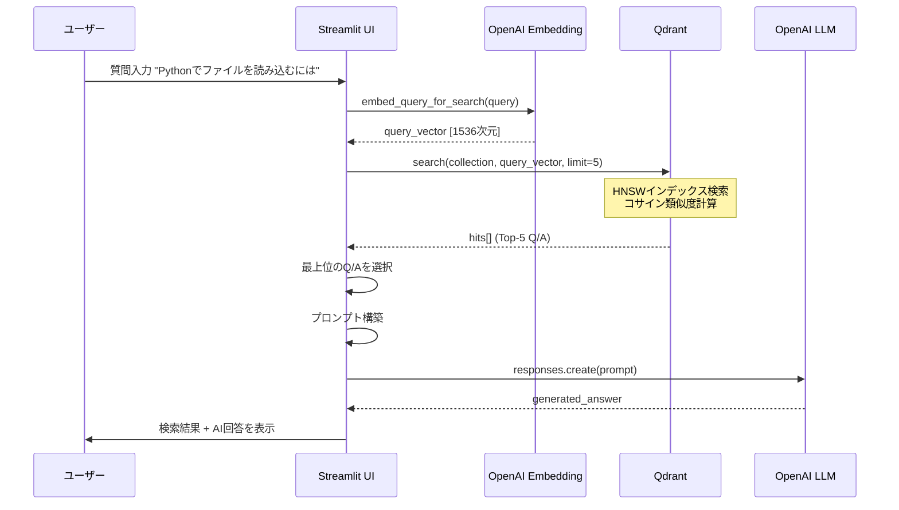
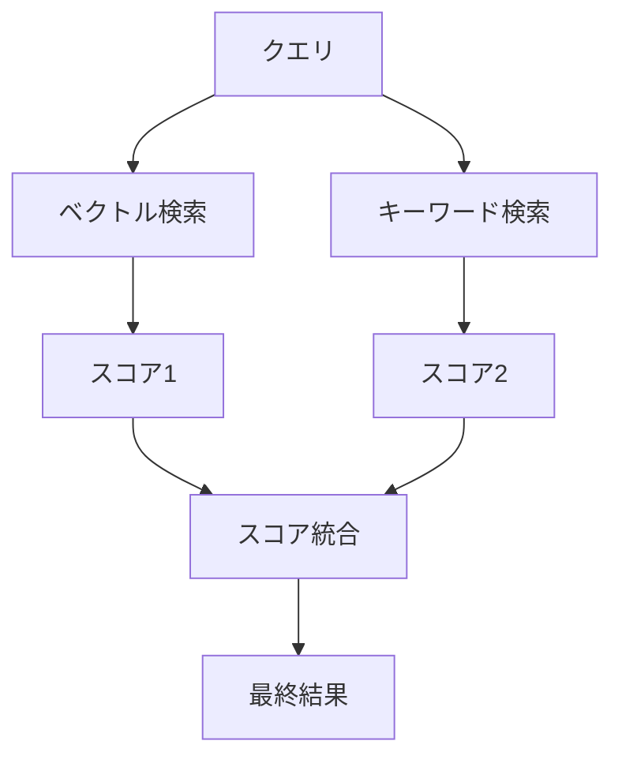
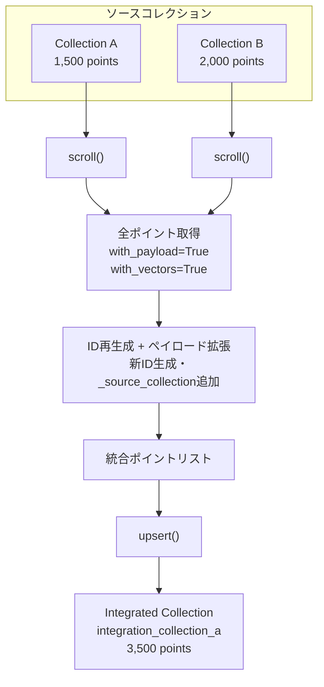

# Qdrant統合・検索・コレクション管理

作成日: 2025-11-28

## 目次

1. [概要](#1-概要)
   - 1.1 [本ドキュメントの目的](#11-本ドキュメントの目的)
   - 1.2 [RAGにおけるQdrantの役割](#12-ragにおけるqdrantの役割)
   - 1.3 [関連ファイル一覧](#13-関連ファイル一覧)
2. [Qdrant基礎知識](#2-qdrant基礎知識)
   - 2.1 [Qdrantとは](#21-qdrantとは)
   - 2.2 [アーキテクチャ](#22-アーキテクチャ)
   - 2.3 [HNSWアルゴリズム（近似最近傍探索）](#23-hnswアルゴリズム近似最近傍探索)
   - 2.4 [距離メトリクス](#24-距離メトリクス)
   - 2.5 [コレクションとポイントの構造](#25-コレクションとポイントの構造)
3. [ベクトルデータの登録](#3-ベクトルデータの登録)
   - 3.1 [Embeddingの生成](#31-embeddingの生成)
   - 3.2 [OpenAI Embedding APIの使用](#32-openai-embedding-apiの使用)
   - 3.3 [PointStruct構造とペイロード設計](#33-pointstruct構造とペイロード設計)
   - 3.4 [バッチアップサート処理](#34-バッチアップサート処理)
   - 3.5 [ペイロードインデックス](#35-ペイロードインデックス)
4. [類似度検索](#4-類似度検索)
   - 4.1 [コサイン類似度の基礎](#41-コサイン類似度の基礎)
   - 4.2 [検索フロー](#42-検索フロー)
   - 4.3 [クエリベクトル化](#43-クエリベクトル化)
   - 4.4 [検索結果の構造](#44-検索結果の構造)
   - 4.5 [ペイロードフィルタリング](#45-ペイロードフィルタリング)
5. [RAG応用（Query&Answer）](#5-rag応用queryanswer)
   - 5.1 [RAGの基本概念](#51-ragの基本概念)
   - 5.2 [Question=Queryから類似Q/Aを検索](#52-questionqueryから類似qaを検索)
   - 5.3 [検索結果に基づくAI回答生成](#53-検索結果に基づくai回答生成)
   - 5.4 [プロンプト設計](#54-プロンプト設計)
   - 5.5 [シーケンス図](#55-シーケンス図)
6. [検索結果の評価](#6-検索結果の評価)
   - 6.1 [スコアの解釈](#61-スコアの解釈)
   - 6.2 [閾値設定の指針](#62-閾値設定の指針)
   - 6.3 [評価指標](#63-評価指標)
   - 6.4 [検索精度の改善テクニック](#64-検索精度の改善テクニック)
7. [コレクション統合](#7-コレクション統合)
   - 7.1 [統合の目的とユースケース](#71-統合の目的とユースケース)
   - 7.2 [統合フロー](#72-統合フロー)
   - 7.3 [scroll_all_points_with_vectors()](#73-scroll_all_points_with_vectors)
   - 7.4 [merge_collections()](#74-merge_collections)
   - 7.5 [ID再生成とペイロード拡張](#75-id再生成とペイロード拡張)
   - 7.6 [UI操作](#76-ui操作)
8. [参考](#8-参考)
   - 8.1 [関数一覧](#81-関数一覧)
   - 8.2 [Qdrant API リファレンス](#82-qdrant-api-リファレンス)
   - 8.3 [パフォーマンスチューニング](#83-パフォーマンスチューニング)

---

## 1. 概要

### 1.1 本ドキュメントの目的

本ドキュメントは以下の3つの技術領域について、Qdrantベクトルデータベースを活用した統合的な解説を行う。

1. **Qdrantの基礎知識** - ベクトルDBの仕組み、HNSWアルゴリズム等
2. **検索の仕組み** - Embedding、類似度検索、Query&Answer生成
3. **コレクション統合** - 複数コレクションの統合機能と運用

### 1.2 RAGにおけるQdrantの役割

RAG（Retrieval-Augmented Generation）システムにおいてQdrantは文脈検索の中核として機能する。



**Qdrantの役割:**
- Q/Aペアのベクトルを高速検索
- コサインベクトル間の類似度計算
- 関連性の高いQ/Aを効率的に検索
- ペイロードフィルタリングによる絞り込み

### 1.3 関連ファイル一覧

| ファイル | 役割 | 主要関数/クラス |
|---------|------|----------------|
| `services/qdrant_service.py` | Qdrant操作サービス層 | `embed_texts_for_qdrant()`, `merge_collections()` |
| `ui/pages/qdrant_search_page.py` | 検索UI | `show_qdrant_search_page()` |
| `ui/pages/qdrant_registration_page.py` | 登録・統合UI | `show_qdrant_registration_page()` |
| `ui/pages/qdrant_show_page.py` | コレクション表示UI | `show_qdrant_page()` |

---

## 2. Qdrant基礎知識

### 2.1 Qdrantとは

**Qdrant**（クアドラント）はRust製の高性能ベクトル類似度検索エンジンである。

| 項目 | 内容 |
|------|------|
| 開発言語 | Rust |
| ライセンス | Apache 2.0 |
| 主要用途 | 類似度検索、セマンティック検索、RAG |
| API | REST API / gRPC |
| クライアント | Python, JavaScript, Rust, Go |

**特徴:**
- **高速検索**: HNSWアルゴリズムによる近似最近傍探索
- **フィルタリング**: 条件付き検索のサポート
- **スケーラビリティ**: ペイロードの柔軟なスキーマ
- **永続化**: ディスクベースのストレージ

### 2.2 アーキテクチャ



**各レイヤーの役割:**

| コンポーネント | 役割 |
|--------------|------|
| API Layer | REST/gRPCリクエストの処理 |
| Collection Manager | コレクションのCRUD管理 |
| HNSW Index | ベクトルの近似最近傍探索インデックス |
| Payload Storage | メタデータ（JSON）の格納 |

### 2.3 HNSWアルゴリズム（近似最近傍探索）

**HNSW（Hierarchical Navigable Small World）** は高次元ベクトルの近似最近傍探索アルゴリズムである。

#### HNSWの構造



**探索の流れ:** 上位レイヤーから開始し、より近い隣接点を辿って下位レイヤーへ移動

**探索アルゴリズム:**

1. **挿入時**: ポイントはランダムな最大レイヤーに配置され、各レイヤーで最近傍と接続
2. **探索時**: 最上位レイヤーから開始し、より近い隣接点を辿って下位レイヤーへ移動
3. **結果**: 完全探索ではないが、非常に高い精度で高速な検索

**主要パラメータ:**

| パラメータ | 説明 | デフォルト | 影響 |
|-----------|------|----------|------|
| `m` | 各レイヤーの接続数 | 16 | 大きいほど精度向上、メモリ増加 |
| `ef_construct` | 構築時の探索幅 | 100 | 大きいほど精度向上、構築時間増加 |
| `ef` | 検索時の探索幅 | 128 | 大きいほど精度向上、検索時間増加 |

**計算量:**
- 挿入: O(log N)
- 検索: O(log N)
- 完全探索比: N=100万で約1000倍高速

### 2.4 距離メトリクス

Qdrantがサポートする距離メトリクス:

| メトリクス | 計算式 | 範囲 | 用途 |
|-----------|------|------|------|
| **Cosine** | 1 - (A・B / \|A\|\|B\|) | 0〜2 | テキスト類似度**（推奨）** |
| **Dot** | -A・B | -∞〜∞ | 非正規化ベクトル |
| **Euclid** | √Σ(Ai-Bi)² | 0〜∞ | 空間距離 |

**本システムでの設定:**

```python
# services/qdrant_service.py:538-540
vectors_config = models.VectorParams(
    size=vector_size,
    distance=models.Distance.COSINE  # コサイン類似度
)
```

**コサイン類似度を選択する理由:**
- テキスト埋め込みは正規化済み
- 文の長さの違いに影響されにくい
- 意味的類似度の計測に最適

### 2.5 コレクションとポイントの構造

#### コレクション（Collection）

コレクションは関連するベクトルデータをグループ化したもの。

```python
# コレクション作成
client.create_collection(
    collection_name="qa_livedoor",
    vectors_config=models.VectorParams(
        size=1536,                    # ベクトル次元数
        distance=models.Distance.COSINE
    )
)
```

<details>
<summary>📝 create_or_recreate_collection_for_qdrant() 完全実装コード</summary>

```python
# services/qdrant_service.py:534-562

def create_or_recreate_collection_for_qdrant(
    client: QdrantClient,
    name: str,
    recreate: bool = False,
    vector_size: int = 1536
):
    """コレクションを作成または再作成"""
    vectors_config = models.VectorParams(
        size=vector_size,
        distance=models.Distance.COSINE
    )

    if recreate:
        # 既存コレクションを削除して新規作成
        try:
            client.delete_collection(collection_name=name)
            logger.info(f"既存コレクション削除: {name}")
        except Exception:
            pass  # 存在しない場合はスキップ

        client.create_collection(
            collection_name=name,
            vectors_config=vectors_config
        )
        logger.info(f"コレクション新規作成: {name}")
    else:
        # 存在しない場合のみ作成
        try:
            client.get_collection(name)
            logger.info(f"コレクション既存: {name}")
        except Exception:
            client.create_collection(
                collection_name=name,
                vectors_config=vectors_config
            )
            logger.info(f"コレクション新規作成: {name}")

    # ペイロードインデックス作成（検索効率化）
    try:
        client.create_payload_index(
            name,
            field_name="domain",
            field_schema=models.PayloadSchemaType.KEYWORD
        )
    except Exception:
        pass  # 既存の場合はスキップ
```

**ポイント:**
- `recreate=True`: 既存削除→新規作成（完全リセット）
- `recreate=False`: 存在しない場合のみ作成（追加登録向け）
- `domain` フィールドにKEYWORDインデックス（フィルタリング高速化）
- COSINE距離メトリクスをデフォルト使用

</details>

#### ポイント（Point）

ポイントはベクトル + ペイロード（メタデータ）の組み合わせ。

```python
point = models.PointStruct(
    id=12345678901234,           # 一意のID（64bit整数）
    vector=[0.023, -0.156, ...], # 1536次元ベクトル
    payload={                     # メタデータ（JSON）
        "question": "質問文",
        "answer": "回答文",
        "domain": "livedoor",
        "source": "a02_qa_pairs_livedoor.csv"
    }
)
```

**構造図:**

```
Collection: qa_livedoor
   Point 1
      id: 123456789
      vector: [0.023, -0.156, 0.089, ...]  (1536次元)
      payload: {"question": "...", "answer": "...", ...}
   Point 2
      id: 987654321
      vector: [0.045, 0.234, -0.012, ...]
      payload: {"question": "...", "answer": "...", ...}
   ... (N points)
```

---

## 3. ベクトルデータの登録

### 3.1 Embeddingの生成

Q/AペアをQdrantに登録するまでのフロー:



### 3.2 OpenAI Embedding APIの使用

本システムでは `text-embedding-3-small` モデルを使用する。

```python
# services/qdrant_service.py:469-531
def embed_texts_for_qdrant(
    texts: List[str],
    model: str,
    batch_size: int = 128
) -> List[List[float]]:
    """テキストをバッチ処理でEmbeddingに変換"""
    enc = tiktoken.get_encoding("cl100k_base")
    client = OpenAI()

    MAX_TOKENS_PER_REQUEST = 8000

    # 空文字列フィルタリング
    valid_texts = []
    valid_indices = []
    for i, text in enumerate(texts):
        if text and text.strip():
            valid_texts.append(text)
            valid_indices.append(i)

    # バッチ処理でAPI呼び出し
    for i, text in enumerate(valid_texts):
        text_tokens = len(enc.encode(text))

        if current_tokens + text_tokens > MAX_TOKENS_PER_REQUEST:
            # バッチ処理
            resp = client.embeddings.create(model=model, input=current_batch)
            valid_vecs.extend([d.embedding for d in resp.data])
            current_batch = []
            current_tokens = 0

        current_batch.append(text)
        current_tokens += text_tokens

    # 最終バッチのインデックスに合わせて再配置
    # 空文字列の位置には [0.0] * 1536 のダミーベクトル
```

<details>
<summary>📝 embed_texts_for_qdrant() 完全実装コード</summary>

```python
# services/qdrant_service.py:469-531

def embed_texts_for_qdrant(
    texts: List[str], model: str, batch_size: int = 128
) -> List[List[float]]:
    """テキストをバッチ処理でEmbeddingに変換"""
    enc = tiktoken.get_encoding("cl100k_base")
    client = OpenAI()

    MAX_TOKENS_PER_REQUEST = 8000

    # 空文字列・空白のみの文字列を除外
    valid_texts = []
    valid_indices = []
    for i, text in enumerate(texts):
        if text and text.strip():
            valid_texts.append(text)
            valid_indices.append(i)

    if not valid_texts:
        logger.warning("全てのテキストが空文字列です。ダミーベクトルを返します。")
        return [[0.0] * 1536] * len(texts)

    # 有効なテキストのみで埋め込み生成
    valid_vecs: List[List[float]] = []
    current_batch = []
    current_tokens = 0
    batch_count = 0

    for i, text in enumerate(valid_texts):
        text_tokens = len(enc.encode(text))

        if text_tokens > MAX_TOKENS_PER_REQUEST:
            raise ValueError(
                f"Single text at index {valid_indices[i]} has {text_tokens} tokens, "
                f"which exceeds MAX_TOKENS_PER_REQUEST ({MAX_TOKENS_PER_REQUEST}). "
            )

        if current_tokens + text_tokens > MAX_TOKENS_PER_REQUEST:
            if current_batch:
                batch_count += 1
                resp = client.embeddings.create(model=model, input=current_batch)
                valid_vecs.extend([d.embedding for d in resp.data])
                current_batch = []
                current_tokens = 0

        current_batch.append(text)
        current_tokens += text_tokens

    if current_batch:
        batch_count += 1
        resp = client.embeddings.create(model=model, input=current_batch)
        valid_vecs.extend([d.embedding for d in resp.data])

    # 元のインデックスに合わせてベクトルを再配置
    vecs: List[List[float]] = []
    valid_vec_idx = 0
    for i in range(len(texts)):
        if i in valid_indices:
            vecs.append(valid_vecs[valid_vec_idx])
            valid_vec_idx += 1
        else:
            vecs.append([0.0] * 1536)  # ダミーベクトル

    return vecs
```

**ポイント:**
- `tiktoken.get_encoding("cl100k_base")`: OpenAI埋め込みモデル用トークナイザー
- `MAX_TOKENS_PER_REQUEST = 8000`: API制限に対応したバッチ分割
- 空文字列位置に `[0.0] * 1536` ダミーベクトル配置（インデックス整合性維持）
- 動的バッチサイズ: トークン数に応じて最適なバッチを構築

</details>

**Embedding設定:**

| 項目 | 値 |
|------|-----|
| モデル | text-embedding-3-small |
| 次元数 | 1536 |
| 最大トークン/リクエスト | 8191 |
| バッチ上限 | 8000トークン/リクエスト |

### 3.3 PointStruct構造とペイロード設計

```python
# services/qdrant_service.py:565-589
def build_points_for_qdrant(
    df: pd.DataFrame,
    vectors: List[List[float]],
    domain: str,
    source_file: str
) -> List[models.PointStruct]:
    """Qdrantポイントを構築"""

    now_iso = datetime.now(timezone.utc).isoformat()
    points: List[models.PointStruct] = []

    for i, row in enumerate(df.itertuples(index=False)):
        payload = {
            "domain": domain,
            "question": getattr(row, "question"),
            "answer": getattr(row, "answer"),
            "source": os.path.basename(source_file),
            "created_at": now_iso,
            "schema": "qa:v1"
        }

        # IDの生成（64ビット正整数）
        pid = abs(hash(f"{domain}-{source_file}-{i}")) & 0x7FFFFFFFFFFFFFFF

        points.append(models.PointStruct(
            id=pid,
            vector=vectors[i],
            payload=payload
        ))

    return points
```

**ペイロードスキーマ（qa:v1）:**

| フィールド | 型 | 説明 |
|-----------|-----|------|
| domain | string | データドメイン（livedoor, cc_news, custom） |
| question | string | 質問文 |
| answer | string | 回答文 |
| source | string | ソースCSVファイル名 |
| created_at | string | 登録日時（ISO 8601） |
| schema | string | スキーマバージョン |

### 3.4 バッチアップサート処理

```python
# services/qdrant_service.py:592-603
def upsert_points_to_qdrant(
    client: QdrantClient,
    collection: str,
    points: List[models.PointStruct],
    batch_size: int = 128
) -> int:
    """ポイントをQdrantにアップサート"""
    count = 0
    for chunk in batched(points, batch_size):
        client.upsert(collection_name=collection, points=chunk)
        count += len(chunk)
    return count
```

**upsertの動作:**
- 同一IDが存在 → 上書き更新
- 新規ID → 新規挿入
- トランザクション的な動作（バッチ単位）

### 3.5 ペイロードインデックス

検索効率化のため、フィールドにインデックスを作成する。

```python
# services/qdrant_service.py:556-562
client.create_payload_index(
    name,
    field_name="domain",
    field_schema=models.PayloadSchemaType.KEYWORD
)
```

**インデックス種別:**

| 種別 | 用途 |
|--------|------|
| KEYWORD | 完全一致検索（domain, source） |
| INTEGER | 数値検索（timestamp） |
| TEXT | 全文検索（question, answer） |

---

## 4. 類似度検索

### 4.1 コサイン類似度の基礎

**コサイン類似度**は2つのベクトルの角度の余弦を計算する。

#### 計算式

```
cos(θ) = (A · B) / (|A| × |B|)

        Σ(Ai × Bi)
     =
       √Σ(Ai²) × √Σ(Bi²)
```

#### 図解

```
        ^ Y
        |
            B (類似度高)
           /
          /  θ (小さい角度)
         /
        /________ A     → X


            C (類似度低)
           \
            \  θ' (大きい角度)
             \

cos(θ) ≈ 1.0  → 類似度が高い
cos(θ) ≈ 0.0  → 類似度なし（直交）
cos(θ) ≈ -1.0 → 類似度が低い（反対）
```

#### テキスト埋め込みでの意味

| コサイン類似度 | 意味 | 例 |
|--------------|------|-----|
| 0.95〜1.00 | 非常に類似 | 同義文 |
| 0.80〜0.94 | 高い類似度 | 同義語+言い換え |
| 0.50〜0.79 | 中程度 | 同義のトピック範囲内 |
| 0.00〜0.49 | 低い類似度 | 意味的に無関係 |
| < 0 | 負の相関 | 反対の意味 |

### 4.2 検索フロー



### 4.3 クエリベクトル化

```python
# services/qdrant_service.py:610-619
def embed_query_for_search(
    query: str,
    model: str = "text-embedding-3-small",
    dims: Optional[int] = None
) -> List[float]:
    """検索クエリをベクトル化"""
    client = OpenAI()
    kwargs = {"model": model, "input": query}
    if dims:
        kwargs["dimensions"] = dims
    resp = client.embeddings.create(**kwargs)
    return resp.data[0].embedding
```

**検索呼び出し:**

```python
# ui/pages/qdrant_search_page.py:184-186
hits = client.search(
    collection_name=collection,
    query_vector=qvec,
    limit=topk
)
```

<details>
<summary>📝 検索フロー 完全実装コード</summary>

```python
# ui/pages/qdrant_search_page.py:160-200

# 検索実行
if do_search and query.strip():
    try:
        client = QdrantClient(url=qdrant_url)

        # コレクションに対応した埋め込み設定を取得
        collection_config = COLLECTION_EMBEDDINGS_SEARCH.get(
            collection, {"model": "text-embedding-3-small", "dims": 1536}
        )
        embedding_model = collection_config["model"]
        embedding_dims = collection_config.get("dims")

        # クエリを埋め込みベクトルに変換
        with st.spinner("埋め込みベクトルを生成中..."):
            qvec = embed_query_for_search(query, embedding_model, embedding_dims)

        # Qdrantで検索
        with st.spinner("検索中..."):
            with warnings.catch_warnings():
                warnings.simplefilter("ignore", DeprecationWarning)
                hits = client.search(
                    collection_name=collection,
                    query_vector=qvec,
                    limit=topk
                )

        # 検索結果をDataFrameに変換
        rows = []
        for h in hits:
            row_data = {
                "スコア": f"{h.score:.4f}",
                "質問": h.payload.get("question", "N/A") if h.payload else "N/A",
                "回答": h.payload.get("answer", "N/A") if h.payload else "N/A",
                "ソース": h.payload.get("source", "N/A") if h.payload else "N/A",
            }
            rows.append(row_data)

        df_results = pd.DataFrame(rows)
        st.dataframe(df_results, use_container_width=True, hide_index=True)

    except Exception as e:
        st.error(f"❌ 検索エラー: {str(e)}")
```

**ポイント:**
- `COLLECTION_EMBEDDINGS_SEARCH`: コレクション毎の埋め込み設定を取得
- `embed_query_for_search()`: クエリを1536次元ベクトルに変換
- `client.search()`: コサイン類似度でTop-K検索
- 結果をDataFrameで表形式表示

</details>

### 4.4 検索結果の構造

```python
# Qdrant search()の戻り値
[
    ScoredPoint(
        id=1234567890123456789,
        score=0.8923,              # コサイン類似度
        payload={
            "question": "Pythonでリストを作成するには",
            "answer": "角括弧[]を使用してリストを作成します...",
            "domain": "livedoor",
            "source": "a02_qa_pairs_livedoor.csv",
            "created_at": "2025-11-28T10:30:00Z",
            "schema": "qa:v1"
        },
        vector=None  # パフォーマンス上、通常は返さない
    ),
    ScoredPoint(
        id=9876543210987654321,
        score=0.8456,
        payload={...}
    ),
    ...
]
```

### 4.5 ペイロードフィルタリング

特定条件でフィルタリングした検索:

```python
# domainでフィルタリング
hits = client.search(
    collection_name="qa_corpus",
    query_vector=qvec,
    query_filter=models.Filter(
        must=[
            models.FieldCondition(
                key="domain",
                match=models.MatchValue(value="livedoor")
            )
        ]
    ),
    limit=10
)

# 複数条件（AND）
query_filter=models.Filter(
    must=[
        models.FieldCondition(key="domain", match=models.MatchValue(value="livedoor")),
        models.FieldCondition(key="schema", match=models.MatchValue(value="qa:v1"))
    ]
)

# OR条件
query_filter=models.Filter(
    should=[
        models.FieldCondition(key="domain", match=models.MatchValue(value="livedoor")),
        models.FieldCondition(key="domain", match=models.MatchValue(value="cc_news"))
    ]
)
```

---

## 5. RAG応用（Query&Answer）

### 5.1 RAGの基本概念

**RAG（Retrieval-Augmented Generation）** は検索拡張生成の手法で、LLMの回答に外部知識を活用する。

**従来のLLMの課題:**
- 学習データに含まれない情報には回答できない
- ハルシネーション（誤った情報の生成）
- 最新情報への未対応

**RAGによる解決:**
- ベクトルDBから関連情報を検索
- 検索結果をコンテキストとしてLLMに提供
- 根拠に基づく回答生成

### 5.2 Question=Queryから類似Q/Aを検索

本システムではユーザーの質問（Query）を以下の流れで処理する:



### 5.3 検索結果に基づくAI回答生成

```python
# ui/pages/qdrant_search_page.py:238-265
best_hit = hits[0]
question = best_hit.payload.get("question", "")
answer = best_hit.payload.get("answer", "")

# プロンプト構築
qa_prompt = (
    "以下の検索結果とユーザーの質問を踏まえて"
    "日本語で簡潔かつ正確に回答してください\n\n"
    f"ユーザーの質問:\n{query}\n\n"
    f"検索結果のスコア: {best_hit.score:.4f}\n"
    f"検索結果の質問: {question}\n"
    f"検索結果の回答: {answer}\n"
)

# OpenAI API呼び出し
oai_client = OpenAI()
oai_resp = oai_client.responses.create(
    model="gpt-4o-mini",
    input=qa_prompt
)
generated_answer = oai_resp.output_text
```

<details>
<summary>📝 RAG応答生成 完全実装コード</summary>

```python
# ui/pages/qdrant_search_page.py:238-265

# 最高スコアの結果でAI応答生成
if hits:
    best_hit = hits[0]
    question = best_hit.payload.get("question", "")
    answer = best_hit.payload.get("answer", "")

    # AI応答生成プロンプト構築
    qa_prompt = (
        "以下の検索結果とユーザーの質問を踏まえて、"
        "日本語で簡潔かつ正確に回答してください。\n\n"
        f"ユーザーの質問:\n{query}\n\n"
        f"検索結果のスコア: {best_hit.score:.4f}\n"
        f"検索結果の質問: {question}\n"
        f"検索結果の回答: {answer}\n"
    )

    # OpenAI API呼び出し（responses.create）
    with st.spinner("AIが回答を生成中..."):
        oai_client = OpenAI()
        oai_resp = oai_client.responses.create(
            model="gpt-4o-mini",
            input=qa_prompt
        )
        generated_answer = getattr(oai_resp, "output_text", None) or ""

    if generated_answer.strip():
        st.markdown("**AI応答:**")
        st.write(generated_answer)
```

**ポイント:**
- `best_hit = hits[0]`: 最高スコアの結果を使用
- プロンプトに検索スコア・質問・回答をコンテキストとして含める
- `responses.create()`: OpenAI Responses APIでAI応答生成
- `getattr(oai_resp, "output_text", None)`: 応答テキストの安全な取得

</details>

### 5.4 プロンプト設計

**RAG用プロンプトの構造:**



### 5.5 シーケンス図



---

## 6. 検索結果の評価

### 6.1 スコアの解釈

Qdrantのコサイン類似度スコアの解釈:

| スコア範囲 | 意味 | 推奨アクション |
|-----------|------|---------------|
| **0.90〜1.00** | 極めて高い類似度 | そのまま回答として使用可能 |
| **0.80〜0.89** | 高い類似度 | AI回答で補完推奨 |
| **0.70〜0.79** | 中程度の類似度 | 参考情報として表示 |
| **0.60〜0.69** | 低い類似度 | 関連情報として表示 |
| **0.60未満** | 関連性が低い | 警告して別の検索を促す |

### 6.2 閾値設定の指針

**閾値の設定:**

```python
# スコア閾値でフィルタリング
hits = client.search(
    collection_name=collection,
    query_vector=qvec,
    score_threshold=0.7,  # 0.7未満は除外
    limit=10
)
```

**閾値設定の目安:**

| ユースケース | 推奨閾値 | 理由 |
|------------|---------|------|
| FAQ検索 | 0.85〜0.90 | 高精度必須 |
| 一般Q&A | 0.70〜0.80 | バランス重視 |
| 探索的検索 | 0.50〜0.60 | 広範囲対象 |

### 6.3 評価指標

**検索精度の評価:**

| 指標 | 定義 | 計算式 |
|------|------|---------|
| **Precision@K** | Top-K中の正解率 | 正解数 / K |
| **Recall@K** | 全正解中の検索率 | 検索正解数 / 全正解数 |
| **MRR** | 最初の正解の位置 | 1 / 正解順位 |
| **NDCG** | 順位の重み付け評価 | DCG / IDCG |

**本システムでの簡易評価:**

```python
def evaluate_search_quality(query, expected_answer, hits):
    """検索の簡易評価"""
    if not hits:
        return {"found": False, "score": 0, "rank": -1}

    for rank, hit in enumerate(hits, 1):
        retrieved_answer = hit.payload.get("answer", "")
        # 回答の類似度判定（簡易版）
        if expected_answer.lower() in retrieved_answer.lower():
            return {
                "found": True,
                "score": hit.score,
                "rank": rank,
                "mrr": 1.0 / rank
            }

    return {"found": False, "score": hits[0].score, "rank": -1}
```

### 6.4 検索精度の改善テクニック

#### 1. クエリ拡張（Query Expansion）

```python
def expand_query(query: str) -> List[str]:
    """同義語でクエリを拡張"""
    expansions = [query]
    # 同義語辞書やLLMで拡張
    # 例: "Python ファイル読込" → ["Python ファイル読込", "Python open関数", "Python read"]
    return expansions
```

#### 2. ハイブリッド検索



#### 3. リランキング

```python
def rerank_results(query: str, hits: List[ScoredPoint]) -> List[ScoredPoint]:
    """検索結果をLLMでリランキング"""
    # Cross-encoderやLLMを使用して順位を調整
    pass
```

---

## 7. コレクション統合

### 7.1 統合の目的とユースケース

**コレクション統合**は複数のコレクションデータを1つにまとめる機能。

**ユースケース:**

| ユースケース | 説明 |
|-------------|------|
| **統合検索** | 複数データソースを横断して検索 |
| **段階的統合** | テスト用コレクションを段階的に本番統合 |
| **インデックス再構築** | 古いインデックスからの移行 |
| **バックアップ復元** | 分散コレクションの復元 |

### 7.2 統合フロー



### 7.3 scroll_all_points_with_vectors()

コレクションから全ポイント（ベクトル含む）を取得する関数。

```python
# services/qdrant_service.py:626-672
def scroll_all_points_with_vectors(
    client: QdrantClient,
    collection_name: str,
    batch_size: int = 100,
    progress_callback: Optional[callable] = None,
) -> List[models.Record]:
    """コレクションから全ポイント（ベクトル含む）を取得"""
    all_points = []
    offset = None

    # 総件数を取得
    collection_info = client.get_collection(collection_name)
    total_points = collection_info.points_count

    while True:
        points, next_offset = client.scroll(
            collection_name=collection_name,
            limit=batch_size,
            offset=offset,
            with_payload=True,
            with_vectors=True,  # ベクトルも取得
        )

        if not points:
            break

        all_points.extend(points)

        if progress_callback:
            progress_callback(len(all_points), total_points)

        if next_offset is None:
            break

        offset = next_offset

    return all_points
```

**パラメータ:**

| パラメータ | 型 | デフォルト | 説明 |
|-----------|-----|---------|------|
| client | QdrantClient | - | Qdrantクライアント |
| collection_name | str | - | コレクション名 |
| batch_size | int | 100 | 1回のスクロールで取得する件数 |
| progress_callback | callable | None | 進捗コールバック |

### 7.4 merge_collections()

複数コレクションを統合する関数。

```python
# services/qdrant_service.py:675-779
def merge_collections(
    client: QdrantClient,
    source_collections: List[str],
    target_collection: str,
    recreate: bool = True,
    vector_size: int = 1536,
    progress_callback: Optional[callable] = None,
) -> Dict[str, Any]:
    """複数コレクションを統合して新コレクションに登録"""

    result = {
        "source_collections": source_collections,
        "target_collection": target_collection,
        "points_per_collection": {},
        "total_points": 0,
        "success": False,
        "error": None,
    }

    # ステップ1: 統合先コレクション作成
    create_or_recreate_collection_for_qdrant(
        client, target_collection, recreate, vector_size
    )

    # ステップ2: 各コレクションからポイント取得
    all_points = []
    for src_collection in source_collections:
        points = scroll_all_points_with_vectors(client, src_collection)
        result["points_per_collection"][src_collection] = len(points)

        # ポイントID再生成
        for i, point in enumerate(points):
            payload = dict(point.payload) if point.payload else {}
            payload["_source_collection"] = src_collection
            payload["_original_id"] = point.id

            new_id = abs(
                hash(f"{target_collection}-{src_collection}-{point.id}-{i}")
            ) & 0x7FFFFFFFFFFFFFFF

            all_points.append(
                models.PointStruct(
                    id=new_id,
                    vector=point.vector,
                    payload=payload,
                )
            )

    # ステップ3: 統合先にアップサート
    for chunk in batched(all_points, 128):
        client.upsert(collection_name=target_collection, points=chunk)

    result["total_points"] = len(all_points)
    result["success"] = True

    return result
```

**戻り値:**

```python
{
    "source_collections": ["qa_livedoor_a02", "qa_cc_news_a02"],
    "target_collection": "integration_qa_livedoor_a02",
    "points_per_collection": {
        "qa_livedoor_a02": 1500,
        "qa_cc_news_a02": 2000
    },
    "total_points": 3500,
    "success": True,
    "error": None
}
```

### 7.5 ID再生成とペイロード拡張

**ID再生成の理由:**
- 複数コレクションでIDが重複する可能性
- 統合後の一意性を確保

**ID生成ロジック:**

```python
new_id = abs(
    hash(f"{target_collection}-{src_collection}-{point.id}-{i}")
) & 0x7FFFFFFFFFFFFFFF
```

**ペイロード拡張:**

```python
# 統合前
{
    "question": "質問文",
    "answer": "回答文",
    "domain": "livedoor",
    "source": "a02_qa_pairs_livedoor.csv",
    "created_at": "2025-11-28T10:30:00Z",
    "schema": "qa:v1"
}

# 統合後（追加フィールド）
{
    "question": "質問文",
    "answer": "回答文",
    "domain": "livedoor",
    "source": "a02_qa_pairs_livedoor.csv",
    "created_at": "2025-11-28T10:30:00Z",
    "schema": "qa:v1",
    "_source_collection": "qa_livedoor_a02",  # 追加
    "_original_id": 1234567890123456789       # 追加
}
```

### 7.6 UI操作

**Streamlit UIでのコレクション統合操作:**

```
1. サイドバーで「コレクション統合」を選択

2. 統合元コレクション選択

    ☑ qa_livedoor_a02 (1,500 ポイント)
    ☑ qa_cc_news_a02 (2,000 ポイント)
    ☐ qa_corpus (500 ポイント)

   ※ 2つ以上選択必須

3. 統合先コレクション名設定

    新しいコレクション名:
    [integration_qa_livedoor_a02    ]
    デフォルト: integration_{先頭名}


4. 「コレクション統合」ボタンクリック

5. 進捗表示
   [████████████████████████████████] 100%
   統合完了: 3,500件

6. 結果確認
   - qa_livedoor_a02: 1,500件
   - qa_cc_news_a02: 2,000件
   - 合計: 3,500件
```

<details>
<summary>📝 コレクション統合UI 完全実装コード</summary>

```python
# ui/pages/qdrant_registration_page.py:531-592

if run_merge:
    st.session_state["merge_logs"] = []
    add_merge_log(f"🔗 統合処理開始")
    add_merge_log(f"統合元: {', '.join(selected_collections)}")
    add_merge_log(f"統合先: {merge_collection_name}")

    # プログレスバーを表示
    progress_bar = progress_placeholder.progress(0)

    def progress_callback(message: str, current: int, total: int):
        """進捗コールバック"""
        add_merge_log(message)
        if total > 0:
            progress_bar.progress(current / total)
        status_placeholder.text(message)

    try:
        # 統合処理を実行
        result = merge_collections(
            client=client,
            source_collections=selected_collections,
            target_collection=merge_collection_name,
            recreate=recreate_merge,
            progress_callback=progress_callback,
        )

        if result["success"]:
            add_merge_log("🎉 統合処理完了！")

            # 各コレクションからの取得件数をログ
            for src_name, count in result["points_per_collection"].items():
                add_merge_log(f"  - {src_name}: {count:,} 件")

            add_merge_log(f"合計: {result['total_points']:,} 件")

            st.success(
                f"✅ {result['total_points']:,}件のデータを "
                f"'{merge_collection_name}' に統合しました"
            )

            # 統計情報を表示
            stats = get_collection_stats(client, merge_collection_name)
            if stats:
                st.divider()
                st.subheader("📊 統合結果")
                st.json(stats)

        else:
            add_merge_log(f"❌ エラー: {result['error']}")
            st.error(f"統合エラー: {result['error']}")

    except Exception as e:
        add_merge_log(f"❌ エラー発生: {str(e)}")
        st.error(f"エラーが発生しました: {str(e)}")

    finally:
        # プログレスバーをクリア
        progress_placeholder.empty()
        status_placeholder.empty()
```

**ポイント:**
- `progress_callback`: 3段階の進捗通知（コレクション作成→データ取得→アップサート）
- コレクション毎の取得件数を詳細ログに記録
- 成功/失敗の結果を詳細に表示
- `finally` でプログレスバーを確実にクリア

</details>

---

## 8. 参考

### 8.1 関数一覧

| 機能 | ファイル | 関数/クラス | 行番号 |
|-----|---------|------------|-------|
| Qdrant設定 | services/qdrant_service.py | QDRANT_CONFIG | 38-46 |
| ヘルスチェック | services/qdrant_service.py | QdrantHealthChecker | 91-137 |
| データ取得 | services/qdrant_service.py | QdrantDataFetcher | 144-329 |
| コレクション統計 | services/qdrant_service.py | get_collection_stats() | 336-374 |
| 全コレクション取得 | services/qdrant_service.py | get_all_collections() | 377-397 |
| CSV読み込み | services/qdrant_service.py | load_csv_for_qdrant() | 431-459 |
| 埋め込み入力構築 | services/qdrant_service.py | build_inputs_for_embedding() | 462-466 |
| 埋め込み生成 | services/qdrant_service.py | embed_texts_for_qdrant() | 469-531 |
| コレクション作成 | services/qdrant_service.py | create_or_recreate_collection_for_qdrant() | 534-562 |
| ポイント構築 | services/qdrant_service.py | build_points_for_qdrant() | 565-589 |
| アップサート | services/qdrant_service.py | upsert_points_to_qdrant() | 592-603 |
| 検索クエリベクトル化 | services/qdrant_service.py | embed_query_for_search() | 610-619 |
| 全ポイント取得 | services/qdrant_service.py | scroll_all_points_with_vectors() | 626-672 |
| コレクション統合 | services/qdrant_service.py | merge_collections() | 675-779 |
| 検索UI | ui/pages/qdrant_search_page.py | show_qdrant_search_page() | 30-279 |
| 登録UI | ui/pages/qdrant_registration_page.py | show_qdrant_registration_page() | 39-600 |

### 8.2 Qdrant API リファレンス

**主要なQdrant Client API:**

| メソッド | 説明 | 例 |
|---------|------|-----|
| `create_collection()` | コレクション作成 | `client.create_collection(name, vectors_config)` |
| `delete_collection()` | コレクション削除 | `client.delete_collection(name)` |
| `get_collection()` | コレクション情報取得 | `client.get_collection(name)` |
| `get_collections()` | 全コレクション一覧 | `client.get_collections()` |
| `upsert()` | ポイント登録/更新 | `client.upsert(collection, points)` |
| `search()` | ベクトル検索 | `client.search(collection, query_vector, limit)` |
| `scroll()` | ページネーション取得 | `client.scroll(collection, limit, offset)` |
| `delete()` | ポイント削除 | `client.delete(collection, points_selector)` |
| `create_payload_index()` | インデックス作成 | `client.create_payload_index(collection, field)` |

### 8.3 パフォーマンスチューニング

#### バッチサイズ設定

| 操作 | 推奨バッチサイズ | 理由 |
|------|----------------|------|
| Embedding | 8000トークン/バッチ | OpenAI API制限 |
| Qdrant upsert | 128ポイント/バッチ | メモリ/レスポンスバランス |
| scroll取得 | 100ポイント/バッチ | 応答速度 |

#### HNSWパラメータ調整

```python
# コレクション作成時に設定
client.create_collection(
    collection_name="high_precision_collection",
    vectors_config=models.VectorParams(
        size=1536,
        distance=models.Distance.COSINE
    ),
    hnsw_config=models.HnswConfigDiff(
        m=32,              # デフォルト16 → 精度向上
        ef_construct=200,  # デフォルト100 → 構築精度向上
    )
)
```

#### メモリ使用量の目安

```
メモリ ≈ ポイント数 × (ベクトル次元数 × 4バイト + ペイロード平均サイズ + HNSWオーバーヘッド)

例: 100万ポイント、1536次元、ペイロード1KB
    ≈ 1,000,000 × (1536 × 4 + 1024 + 100)
    ≈ 7.3 GB
```

### 8.4 QdrantHealthChecker（接続チェック）

Qdrantサーバーの接続状態を確認するユーティリティクラス。

<details>
<summary>📝 QdrantHealthChecker 完全実装コード</summary>

```python
# services/qdrant_service.py:91-137

class QdrantHealthChecker:
    """Qdrantサーバーの接続状態をチェック"""

    def __init__(self, debug_mode: bool = False):
        self.debug_mode = debug_mode
        self.client = None

    def check_port(self, host: str, port: int, timeout: float = 2.0) -> bool:
        """ポートが開いているかチェック"""
        try:
            sock = socket.socket(socket.AF_INET, socket.SOCK_STREAM)
            sock.settimeout(timeout)
            result = sock.connect_ex((host, port))
            sock.close()
            return result == 0
        except Exception as e:
            if self.debug_mode:
                logger.error(f"Port check failed for {host}:{port}: {e}")
            return False

    def check_qdrant(self) -> Tuple[bool, str, Optional[Dict]]:
        """Qdrant接続チェック"""
        start_time = time.time()

        # まずポートチェック
        if not self.check_port(QDRANT_CONFIG["host"], QDRANT_CONFIG["port"]):
            return False, "Connection refused (port closed)", None

        try:
            self.client = QdrantClient(url=QDRANT_CONFIG["url"], timeout=5)

            # コレクション取得
            collections = self.client.get_collections()

            metrics = {
                "collection_count": len(collections.collections),
                "collections": [c.name for c in collections.collections],
                "response_time_ms": round((time.time() - start_time) * 1000, 2),
            }

            return True, "Connected", metrics

        except Exception as e:
            error_msg = str(e)
            if self.debug_mode:
                error_msg = f"{error_msg}\n{traceback.format_exc()}"
            return False, error_msg, None
```

**使用例:**

```python
checker = QdrantHealthChecker(debug_mode=False)
is_connected, message, metrics = checker.check_qdrant()

if is_connected:
    print(f"✅ {message}")
    print(f"   コレクション数: {metrics['collection_count']}")
    print(f"   応答時間: {metrics['response_time_ms']}ms")
else:
    print(f"❌ {message}")
```

**ポイント:**
- `check_port()`: ソケットレベルでポート開放確認（高速な事前チェック）
- `timeout=2.0`: ポートチェックは2秒、API接続は5秒でタイムアウト
- `response_time_ms`: レスポンスタイム計測（パフォーマンス監視用）
- `debug_mode=True`: トラブルシューティング時にスタックトレース表示

</details>

---

## 関連ドキュメント

- [doc/06_embedding_qdrant.md](./06_embedding_qdrant.md) - Embedding・Qdrant登録・検索の詳細
- [doc/rag_qa_pair_qdrant.md](./rag_qa_pair_qdrant.md) - システム全体のドキュメント
- [Qdrant公式ドキュメント](https://qdrant.tech/documentation/) - 公式リファレンス