# rag_qa_pair_qdrant.py ドキュメント

作成日: 2025-11-27
更新日: 2025-11-28

## 目次

1. [概要](#1-概要)
   - 1.1 [本モジュールの目的](#11-本モジュールの目的)
   - 1.2 [主な機能（6画面の概要）](#12-主な機能6画面の概要)
   - 1.3 [対応データセット](#13-対応データセット)
2. [アーキテクチャ](#2-アーキテクチャ)
   - 2.1 [システム構成図（3層アーキテクチャ）](#21-システム構成図3層アーキテクチャ)
   - 2.2 [モジュール依存関係図](#22-モジュール依存関係図)
   - 2.3 [レイヤー別役割分担表](#23-レイヤー別役割分担表)
   - 2.4 [システムアーキテクチャ図（Mermaid）](#24-システムアーキテクチャ図mermaid)
   - 2.5 [コンポーネント連携シーケンス図](#25-コンポーネント連携シーケンス図)
   - 2.6 [データフロー図（Mermaid）](#26-データフロー図mermaid)
3. [データフロー](#3-データフロー)
   - 3.1 [エンドツーエンド処理フロー図](#31-エンドツーエンド処理フロー図)
   - 3.2 [各ステップの入出力](#32-各ステップの入出力)
   - 3.3 [ディレクトリ構造](#33-ディレクトリ構造)
4. [サービス層 (services/)](#4-サービス層-services)
   - 4.1 [dataset_service.py - データセット操作](#41-dataset_servicepy---データセット操作)
   - 4.2 [qdrant_service.py - Qdrant操作](#42-qdrant_servicepy---qdrant操作)
   - 4.3 [file_service.py - ファイル操作](#43-file_servicepy---ファイル操作)
   - 4.4 [qa_service.py - Q/A生成](#44-qa_servicepy---qa生成)
5. [UI層 (ui/pages/)](#5-ui層-uipages)
   - 5.1 [画面一覧と遷移](#51-画面一覧と遷移)
   - 5.2 [各ページの機能詳細](#52-各ページの機能詳細)
6. [メニュー単位の処理概要・処理方式](#6-メニュー単位の処理概要処理方式)
   - 6.1 [📖 説明](#61--説明)
   - 6.2 [📥 RAGデータダウンロード](#62--ragデータダウンロード)
   - 6.3 [🤖 Q/A生成](#63--qa生成)
   - 6.4 [🗄️ Qdrant登録](#64--qdrant登録)
   - 6.5 [🔍 Show-Qdrant](#65--show-qdrant)
   - 6.6 [🔎 Qdrant検索](#66--qdrant検索)
7. [設定・依存関係](#7-設定依存関係)
   - 7.1 [必須環境変数](#71-必須環境変数)
   - 7.2 [依存サービス](#72-依存サービス)
   - 7.3 [主要な定数・設定値](#73-主要な定数設定値)
8. [使用方法](#8-使用方法)
   - 8.1 [起動手順](#81-起動手順)
   - 8.2 [典型的なワークフロー](#82-典型的なワークフロー)
   - 8.3 [トラブルシューティング](#83-トラブルシューティング)

---

## 1. 概要

### 1.1 本モジュールの目的

`rag_qa_pair_qdrant.py` は、RAG（Retrieval-Augmented Generation）システムのための統合管理ツールです。

**一言で言うと**: RAG Q&A生成・Qdrant管理の統合Streamlitアプリケーション

**役割**:
- データ取得からベクトル検索までの **RAGパイプライン全体** を管理
- **6つの画面** で構成されるWebインターフェース
- **薄いエントリポイント** として機能し、実処理はサービス層に委譲

| 項目 | 内容 |
|------|------|
| ファイル名 | rag_qa_pair_qdrant.py |
| 行数 | 142行（エントリポイントのみ） |
| フレームワーク | Streamlit |
| 起動コマンド | `streamlit run rag_qa_pair_qdrant.py --server.port=8500` |

### 1.2 主な機能（6画面の概要）

| 画面 | アイコン | 機能概要 |
|------|---------|---------|
| 説明 | 📖 | システムのデータフロー・ディレクトリ構造を表示 |
| RAGデータDL | 📥 | HuggingFace/ローカルファイルからデータ取得・前処理 |
| Q/A生成 | 🤖 | OpenAI APIによるQ&Aペア自動生成（Celery並列処理対応） |
| Qdrant登録 | 🗄️ | Q&AペアをQdrantベクトルDBに登録・**コレクション統合** |
| Show-Qdrant | 🔍 | Qdrantコレクション内容の閲覧 |
| Qdrant検索 | 🔎 | セマンティック検索によるQ&A検索 |

### 1.3 対応データセット

| データセット | 識別子 | 説明 | 件数目安 |
|-------------|--------|------|---------|
| Wikipedia日本語 | `wikipedia_ja` | Wikipedia日本語版 | 大規模 |
| CC100日本語 | `japanese_text` | CC100日本語（Webテキスト） | 大規模 |
| CC-News | `cc_news` | CC-News英語ニュース | 大規模 |
| Livedoor | `livedoor` | Livedoorニュースコーパス（9カテゴリ） | 7,376件 |
| カスタム | `custom_upload` | ローカルファイル（CSV/TXT/JSON/JSONL） | 任意 |

---

## 2. アーキテクチャ

### 2.1 システム構成図（3層アーキテクチャ）

```
┌─────────────────────────────────────────────────────────────────┐
│                      プレゼンテーション層                          │
│  ┌─────────────────────────────────────────────────────────┐   │
│  │  rag_qa_pair_qdrant.py (Streamlit エントリポイント)       │   │
│  │  └─ ui/pages/*.py (6画面)                               │   │
│  └─────────────────────────────────────────────────────────┘   │
└─────────────────────────────────────────────────────────────────┘
                              │
                              ▼
┌─────────────────────────────────────────────────────────────────┐
│                        ビジネスロジック層                         │
│  ┌─────────────────────────────────────────────────────────┐   │
│  │  services/                                              │   │
│  │  ├─ dataset_service.py  (データセット操作)               │   │
│  │  ├─ qdrant_service.py   (Qdrant操作・コレクション統合)    │   │
│  │  ├─ file_service.py     (ファイル操作)                   │   │
│  │  └─ qa_service.py       (Q/A生成)                       │   │
│  └─────────────────────────────────────────────────────────┘   │
└─────────────────────────────────────────────────────────────────┘
                              │
                              ▼
┌─────────────────────────────────────────────────────────────────┐
│                         データアクセス層                          │
│  ┌───────────────┐  ┌───────────────┐  ┌───────────────┐       │
│  │   OpenAI API  │  │    Qdrant     │  │  File System  │       │
│  │  (埋め込み生成) │  │ (ベクトルDB)  │  │ (CSV/JSON)    │       │
│  └───────────────┘  └───────────────┘  └───────────────┘       │
└─────────────────────────────────────────────────────────────────┘
```

### 2.2 モジュール依存関係図

```
rag_qa_pair_qdrant.py
    │
    ├─► ui/pages/__init__.py
    │       ├─► explanation_page.py
    │       ├─► download_page.py ─────────► services/dataset_service.py
    │       ├─► qa_generation_page.py ────► services/qa_service.py
    │       ├─► qdrant_registration_page.py ─► services/qdrant_service.py
    │       │       └─ 3操作モード: 全コレクション/個別CSV/コレクション統合
    │       ├─► qdrant_show_page.py ──────► services/qdrant_service.py
    │       └─► qdrant_search_page.py ────► services/qdrant_service.py
    │
    └─► services/__init__.py
            ├─► dataset_service.py ───► helper_rag.py
            ├─► qdrant_service.py ────► qdrant_client, openai
            │       └─ merge_collections(), scroll_all_points_with_vectors()
            ├─► file_service.py ──────► config.py
            └─► qa_service.py ────────► models.py, openai
```

### 2.3 レイヤー別役割分担表

| レイヤー | モジュール | 責務 |
|---------|-----------|------|
| **エントリポイント** | `rag_qa_pair_qdrant.py` | Streamlitアプリ起動、画面ルーティング |
| **UI層** | `ui/pages/*.py` | ユーザーインターフェース、入力検証、表示制御 |
| **サービス層** | `services/*.py` | ビジネスロジック、外部API呼び出し、データ変換 |
| **ヘルパー層** | `helper_*.py` | 共通ユーティリティ、設定管理 |
| **モデル層** | `models.py` | データ構造定義（Pydantic） |

### 2.4 システムアーキテクチャ図（Mermaid）

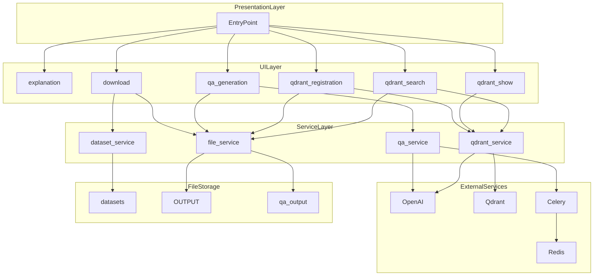

### 2.5 コンポーネント連携シーケンス図

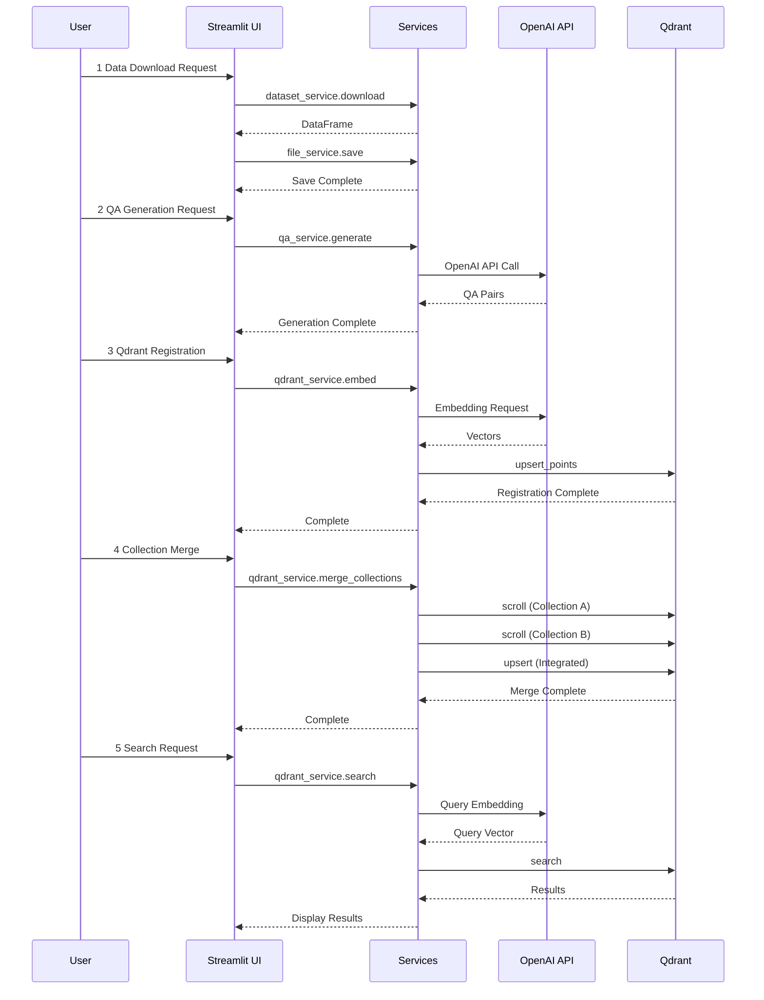

### 2.6 データフロー図（Mermaid）

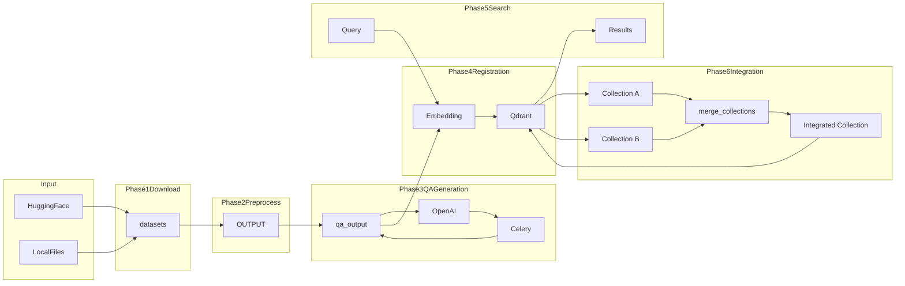

---

## 3. データフロー

### 3.1 エンドツーエンド処理フロー図

```
┌─────────────────┐
│  HuggingFace    │
│  / ローカル     │
└────────┬────────┘
         │ ①ダウンロード
         ▼
┌─────────────────────────────────┐
│  datasets/                      │
│  (生データ)                     │
└────────┬────────────────────────┘
         │ ②前処理（クレンジング）
         ▼
┌─────────────────────────────────┐
│  OUTPUT/                        │
│  preprocessed_*.csv             │
└────────┬────────────────────────┘
         │ ③Q/A生成（OpenAI API）
         ▼
┌─────────────────────────────────┐
│  qa_output/                     │
│  a02_qa_pairs_*.csv             │
└────────┬────────────────────────┘
         │ ④埋め込み生成・登録
         ▼
┌─────────────────────────────────┐
│  Qdrant                         │
│  (ベクトルDB)                    │
│                                 │
│  ⑤コレクション統合（任意）       │
│  Collection A + B → Integrated  │
└─────────────────────────────────┘
```

### 3.2 各ステップの入出力

| ステップ | 処理内容 | 入力 | 出力 | 担当サービス |
|---------|---------|------|------|-------------|
| ① | ダウンロード | HuggingFace URL | `datasets/*.csv` | `dataset_service` |
| ② | 前処理 | `datasets/*.csv` | `OUTPUT/preprocessed_*.csv` | `dataset_service`, `file_service` |
| ③ | Q/A生成 | `OUTPUT/preprocessed_*.csv` | `qa_output/a02_qa_pairs_*.csv` | `qa_service` |
| ④ | ベクトル登録 | `qa_output/*.csv` | Qdrantコレクション | `qdrant_service` |
| ⑤ | コレクション統合 | 複数Qdrantコレクション | 統合コレクション | `qdrant_service` |

### 3.3 ディレクトリ構造

```
openai_rag_qa_jp/
├── rag_qa_pair_qdrant.py     # メインエントリポイント (142行)
│
├── services/                  # ビジネスロジック層
│   ├── __init__.py           # エクスポート定義
│   ├── dataset_service.py    # データセット操作
│   ├── qdrant_service.py     # Qdrant操作・コレクション統合
│   ├── file_service.py       # ファイル操作
│   └── qa_service.py         # Q/A生成
│
├── ui/pages/                  # UI層
│   ├── __init__.py           # エクスポート定義
│   ├── explanation_page.py   # 説明ページ
│   ├── download_page.py      # ダウンロードページ
│   ├── qa_generation_page.py # Q/A生成ページ
│   ├── qdrant_registration_page.py  # 登録ページ（3操作モード）
│   ├── qdrant_show_page.py   # 表示ページ
│   └── qdrant_search_page.py # 検索ページ
│
├── datasets/                  # ①生データ保存先
│   ├── wikimedia_wikipedia_train_*.csv
│   ├── cc_news_train_*.csv
│   └── livedoor/text/
│
├── OUTPUT/                    # ②前処理済みデータ
│   ├── preprocessed_wikipedia_ja.csv
│   ├── preprocessed_cc_news.csv
│   └── preprocessed_livedoor.csv
│
└── qa_output/                 # ③生成Q/Aペア
    ├── a02_qa_pairs_cc_news.csv
    ├── a02_qa_pairs_livedoor.csv
    └── coverage_*.json
```

---

## 4. サービス層 (services/)

### 4.1 dataset_service.py - データセット操作

**責務**: データセットのダウンロード、読み込み、前処理

#### 主要関数

| 関数名 | 引数 | 戻り値 | 説明 |
|--------|------|--------|------|
| `download_livedoor_corpus` | `save_dir: str` | `str` | Livedoorコーパスをダウンロード・解凍 |
| `load_livedoor_corpus` | `data_dir: str` | `pd.DataFrame` | Livedoorコーパスを読み込み |
| `download_hf_dataset` | `dataset_name, config_name, split, sample_size, log_callback` | `pd.DataFrame` | HuggingFaceからデータセットをダウンロード |
| `extract_text_content` | `df, config` | `pd.DataFrame` | テキストコンテンツを抽出（Combined_Text列作成） |
| `load_uploaded_file` | `uploaded_file` | `pd.DataFrame` | アップロードファイル（CSV/TXT/JSON/JSONL）を読み込み |

### 4.2 qdrant_service.py - Qdrant操作

**責務**: Qdrantベクトルデータベースの操作、埋め込み生成、コレクション統合

#### 主要クラス

| クラス名 | 説明 |
|---------|------|
| `QdrantHealthChecker` | Qdrantサーバーの接続状態チェック |
| `QdrantDataFetcher` | Qdrantからのデータ取得 |

#### 主要関数

| 関数名 | 説明 | 行番号 |
|--------|------|-------|
| `get_collection_stats` | コレクションの統計情報取得 | 336-374 |
| `get_all_collections` | 全コレクション情報取得 | 377-397 |
| `delete_all_collections` | 全コレクション削除 | 400-424 |
| `load_csv_for_qdrant` | CSV読み込み（Qdrant登録用） | 431-459 |
| `build_inputs_for_embedding` | 埋め込み用入力テキスト構築 | 462-466 |
| `embed_texts_for_qdrant` | テキストをバッチ処理でEmbedding変換 | 469-531 |
| `create_or_recreate_collection_for_qdrant` | コレクション作成/再作成 | 534-562 |
| `build_points_for_qdrant` | Qdrantポイント構築 | 565-589 |
| `upsert_points_to_qdrant` | ポイントをQdrantにアップサート | 592-603 |
| `embed_query_for_search` | 検索クエリをベクトル化 | 610-619 |
| `scroll_all_points_with_vectors` | コレクションから全ポイント（ベクトル含む）を取得 | 626-672 |
| `merge_collections` | 複数コレクションを統合して新コレクションに登録 | 675-779 |

#### コレクション統合関数

```python
def merge_collections(
    client: QdrantClient,
    source_collections: List[str],  # 統合元コレクション名リスト
    target_collection: str,          # 統合先コレクション名
    recreate: bool = True,           # 既存コレクションを削除して再作成
    vector_size: int = 1536,         # ベクトルサイズ
    progress_callback: Optional[callable] = None,
) -> Dict[str, Any]:
    """複数コレクションを統合して新コレクションに登録"""
```

**戻り値**:
```python
{
    "source_collections": ["qa_livedoor_a02", "qa_cc_news_a02"],
    "target_collection": "integration_qa_livedoor_a02",
    "points_per_collection": {
        "qa_livedoor_a02": 1500,
        "qa_cc_news_a02": 2000
    },
    "total_points": 3500,
    "success": True,
    "error": None
}
```

### 4.3 file_service.py - ファイル操作

**責務**: ファイルの読み込み、保存、履歴管理

#### 主要関数

| 関数名 | 説明 |
|--------|------|
| `load_qa_output_history` | `qa_output/`からQ&AペアCSVファイル一覧取得 |
| `load_preprocessed_history` | `OUTPUT/`から前処理済みCSVファイル一覧取得 |
| `save_to_output` | OUTPUTフォルダに保存（CSV/TXT/JSON） |
| `load_sample_questions_from_csv` | CSVから質問例を取得 |
| `load_source_qa_data` | `qa_output/*.csv`からQ/Aデータ取得 |
| `load_collection_qa_preview` | コレクション対応CSVからプレビュー取得 |

### 4.4 qa_service.py - Q/A生成

**責務**: Q/Aペアの生成と保存

#### 主要関数

| 関数名 | 説明 |
|--------|------|
| `run_advanced_qa_generation` | `a02_make_qa_para.py`をサブプロセスで実行（Celery並列処理対応） |
| `generate_qa_pairs` | テキストからQ/Aペアを生成（OpenAI API） |
| `save_qa_pairs_to_file` | Q/AペアをCSVとJSONで保存 |

---

## 5. UI層 (ui/pages/)

### 5.1 画面一覧と遷移

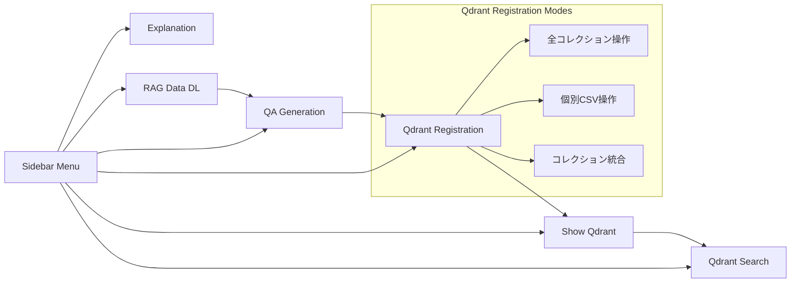

### 5.2 各ページの機能詳細

| ページ | ファイル | 主要機能 |
|--------|---------|---------|
| 説明 | `explanation_page.py` | データフロー図表示、ディレクトリ構造説明、コマンド早見表 |
| RAGデータDL | `download_page.py` | データセット選択、ダウンロード、前処理、保存 |
| Q/A生成 | `qa_generation_page.py` | モデル選択、パラメータ設定、Celery並列処理、進捗表示 |
| Qdrant登録 | `qdrant_registration_page.py` | **3操作モード**: 全コレクション操作/個別CSV操作/コレクション統合 |
| Show-Qdrant | `qdrant_show_page.py` | コレクション一覧、詳細表示、データ閲覧 |
| Qdrant検索 | `qdrant_search_page.py` | 検索クエリ入力、類似度検索、結果表示 |

---

## 6. メニュー単位の処理概要・処理方式

### 6.1 📖 説明

#### 処理概要

システム全体の説明ドキュメントを表示する静的ページ。ユーザーがシステムの構造・使い方を理解するためのリファレンス。

#### 処理方式

| 項目 | 内容 |
|------|------|
| **処理タイプ** | 静的表示（Static Rendering） |
| **データソース** | なし（ハードコード） |
| **外部API** | なし |
| **状態管理** | なし |
| **担当ファイル** | `ui/pages/explanation_page.py` |

#### 処理フロー図

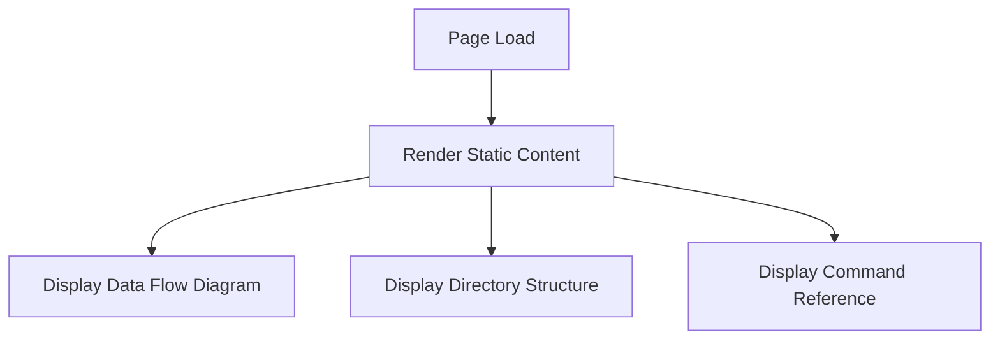

#### 表示コンテンツ

- データフロー図（ASCII art）
- ステップ詳細表
- ディレクトリ構造
- 実行コマンド早見表
- 対応データセット一覧

---

### 6.2 📥 RAGデータダウンロード

#### 処理概要

HuggingFaceまたはローカルファイルからデータを取得し、テキスト抽出・クレンジングを行い、`OUTPUT/`に前処理済みCSVとして保存する。

#### 処理方式

| 項目 | 内容 |
|------|------|
| **処理タイプ** | 同期処理（ストリーミング対応） |
| **データソース** | HuggingFace Hub / ローカルファイル |
| **外部API** | HuggingFace `datasets` ライブラリ |
| **出力先** | `datasets/` → `OUTPUT/preprocessed_*.csv` |
| **担当サービス** | `dataset_service`, `file_service` |
| **担当ファイル** | `ui/pages/download_page.py` |

#### 処理フロー図

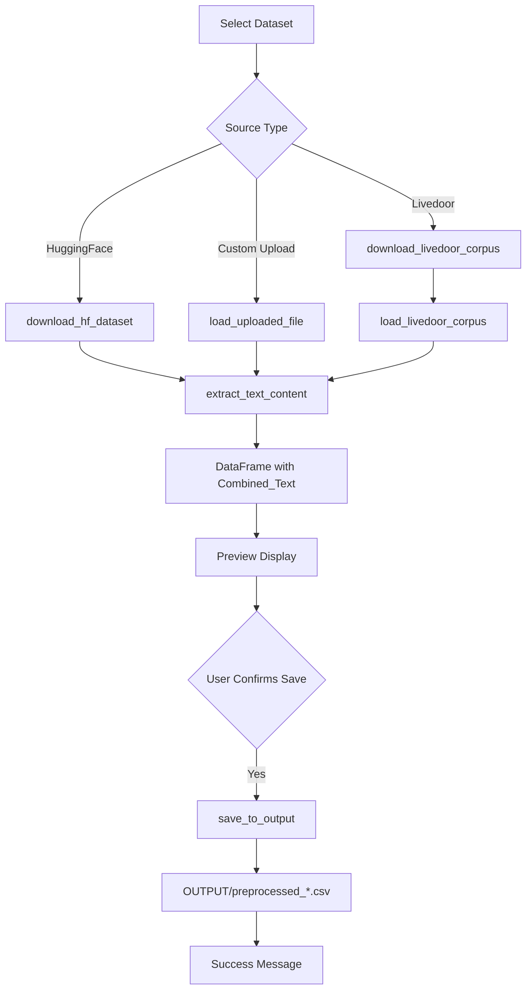

#### 主要パラメータ

| パラメータ | 説明 | デフォルト値 |
|-----------|------|-------------|
| `dataset_name` | データセット識別子 | - |
| `sample_size` | ダウンロードするサンプル数 | 1000 |
| `split` | データ分割（train/test） | "train" |
| `config_name` | HuggingFace config | データセット依存 |

#### 入出力ファイル

| 入力 | 出力 |
|------|------|
| HuggingFace Dataset / Local File | `datasets/{dataset}_train_{count}_{timestamp}.csv` |
| - | `OUTPUT/preprocessed_{dataset}_{timestamp}.csv` |
| - | `OUTPUT/{dataset}_{timestamp}.txt` |
| - | `OUTPUT/metadata_{dataset}_{timestamp}.json` |

---

### 6.3 🤖 Q/A生成

#### 処理概要

前処理済みテキストデータから、OpenAI APIを使用してQ&Aペアを自動生成する。大規模データに対応するためCelery並列処理をサポート。

#### 処理方式

| 項目 | 内容 |
|------|------|
| **処理タイプ** | 非同期処理（Celery対応）/ 同期処理 |
| **データソース** | `OUTPUT/preprocessed_*.csv` |
| **外部API** | OpenAI Chat Completions API (responses.parse) |
| **出力先** | `qa_output/a02_qa_pairs_*.csv` |
| **担当サービス** | `qa_service`, `file_service` |
| **担当ファイル** | `ui/pages/qa_generation_page.py` |

#### 処理フロー図

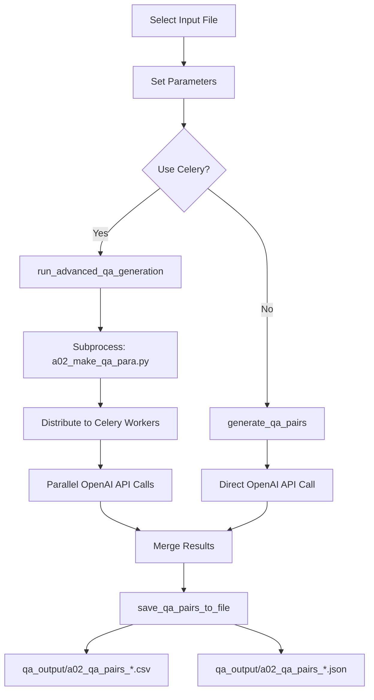

#### 主要パラメータ

| パラメータ | 説明 | デフォルト値 |
|-----------|------|-------------|
| `model` | 使用モデル | gpt-4o-mini |
| `use_celery` | Celery並列処理の有効化 | False |
| `celery_workers` | Celeryワーカー数 | 24 |
| `batch_chunks` | バッチあたりのチャンク数 | 10 |
| `max_docs` | 処理する最大ドキュメント数 | 100 |
| `min_tokens` | チャンクの最小トークン数 | 50 |
| `max_tokens` | チャンクの最大トークン数 | 500 |
| `coverage_threshold` | カバレージ閾値 | 0.8 |

#### 対応モデル

- GPT-4oシリーズ: `gpt-4o`, `gpt-4o-mini`
- GPT-5シリーズ: `gpt-5`, `gpt-5-mini`, `gpt-5-nano`
- O-series: `o1`, `o3`, `o4`, `o1-mini`, `o3-mini`, `o4-mini`

#### Celery並列処理アーキテクチャ

```
┌─────────────┐     ┌─────────────┐     ┌─────────────┐
│  Streamlit  │────►│   Redis     │────►│   Celery    │
│     UI      │     │  (Broker)   │     │  Workers    │
└─────────────┘     └─────────────┘     └──────┬──────┘
                                               │
                                               ▼
                                        ┌─────────────┐
                                        │  OpenAI API │
                                        └─────────────┘
```

---

### 6.4 🗄️ Qdrant登録

#### 処理概要

Q&AペアCSVファイルを読み込み、OpenAI Embedding APIでベクトル化し、Qdrantベクトルデータベースに登録する。また、複数コレクションの統合機能を提供。

#### 3つの操作モード

| モード | アイコン | 機能 |
|--------|---------|------|
| 全コレクション操作 | 📊 | コレクション一覧表示・一括削除・詳細統計 |
| 個別CSV操作 | 📄 | CSVファイルからQdrantに登録 |
| コレクション統合 | 🔗 | 複数コレクションを1つに統合 |

#### 処理方式

| 項目 | 内容 |
|------|------|
| **処理タイプ** | バッチ処理（同期） |
| **データソース** | `qa_output/*.csv` / Qdrantコレクション |
| **外部API** | OpenAI Embeddings API |
| **出力先** | Qdrantコレクション |
| **担当サービス** | `qdrant_service`, `file_service` |
| **担当ファイル** | `ui/pages/qdrant_registration_page.py` |

#### 処理フロー図（個別CSV操作）

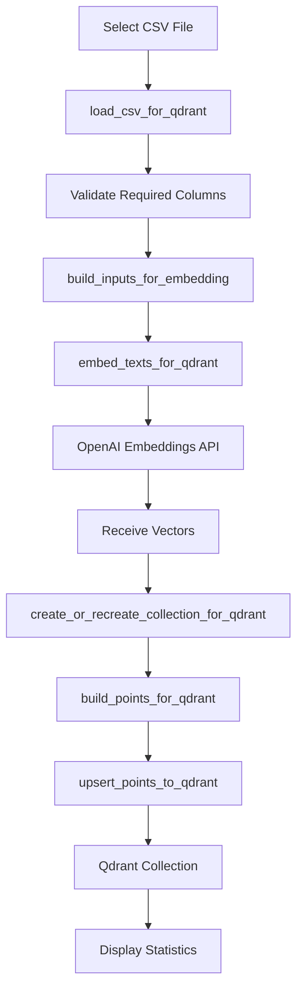

#### 処理フロー図（コレクション統合）

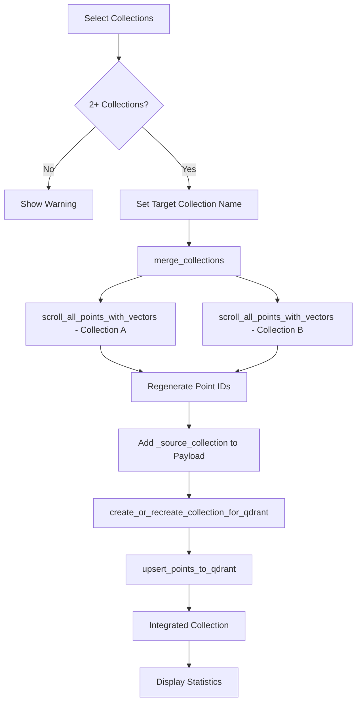

#### 主要パラメータ（個別CSV操作）

| パラメータ | 説明 | デフォルト値 |
|-----------|------|-------------|
| `collection_name` | Qdrantコレクション名 | - |
| `recreate` | コレクション再作成フラグ | False |
| `include_answer` | 回答テキストを埋め込みに含める | True |
| `embedding_model` | 埋め込みモデル | text-embedding-3-small |
| `batch_size` | バッチサイズ | 128 |
| `vector_size` | ベクトル次元数 | 1536 |

#### 主要パラメータ（コレクション統合）

| パラメータ | 説明 | デフォルト値 |
|-----------|------|-------------|
| `source_collections` | 統合元コレクション名リスト | - |
| `target_collection` | 統合先コレクション名 | `integration_{先頭コレクション名}` |
| `recreate` | 既存コレクション再作成フラグ | True |
| `vector_size` | ベクトル次元数 | 1536 |

#### ペイロード構造（基本）

```python
{
    "domain": "qa_cc_news",           # ドメイン識別子
    "question": "質問文",              # 質問テキスト
    "answer": "回答文",                # 回答テキスト
    "source": "a02_qa_pairs_cc_news.csv",  # ソースファイル名
    "created_at": "2024-11-26T12:00:00Z",  # 登録日時
    "schema": "qa:v1"                 # スキーマバージョン
}
```

#### ペイロード構造（統合時の追加フィールド）

```python
{
    "domain": "qa_cc_news",
    "question": "質問文",
    "answer": "回答文",
    "source": "a02_qa_pairs_cc_news.csv",
    "created_at": "2024-11-26T12:00:00Z",
    "schema": "qa:v1",
    "_source_collection": "qa_cc_news_a02",  # 統合元コレクション名
    "_original_id": 1234567890123456789      # 統合元での元ID
}
```

#### コレクション命名規則

```
qa_{dataset}_{method}
  │      │       │
  │      │       └─ 生成方式（a02_llm, a03_rule, a10_hybrid）
  │      └─ データセット名（cc_news, livedoor）
  └─ プレフィックス（固定）

integration_{collection_name}
  │              │
  │              └─ 統合元の先頭コレクション名
  └─ 統合コレクションプレフィックス
```

---

### 6.5 🔍 Show-Qdrant

#### 処理概要

Qdrantに登録されているコレクションの一覧と詳細データを閲覧する。ヘルスチェック、統計情報、サンプルデータの表示を行う。

#### 処理方式

| 項目 | 内容 |
|------|------|
| **処理タイプ** | 同期取得・表示 |
| **データソース** | Qdrant API |
| **外部API** | Qdrant REST API |
| **出力先** | Streamlit UI |
| **担当サービス** | `qdrant_service` |
| **担当ファイル** | `ui/pages/qdrant_show_page.py` |

#### 処理フロー図

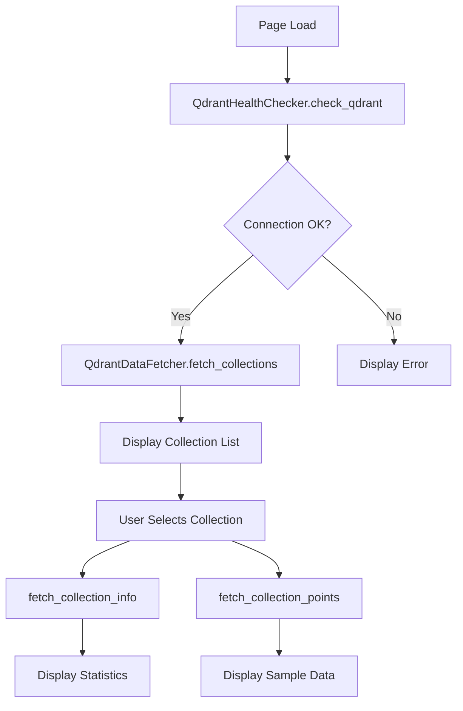

#### 表示項目

| 項目 | 説明 |
|------|------|
| Collection | コレクション名 |
| Vectors Count | ベクトル総数 |
| Points Count | ポイント総数 |
| Indexed Vectors | インデックス済みベクトル数 |
| Status | コレクションステータス |
| Vector Size | ベクトル次元数 |
| Distance | 距離関数（COSINE） |

#### QdrantHealthChecker

```python
class QdrantHealthChecker:
    def check_port(host, port, timeout=2.0) -> bool
    def check_qdrant() -> Tuple[bool, str, Optional[Dict]]
```

#### QdrantDataFetcher

```python
class QdrantDataFetcher:
    def fetch_collections() -> pd.DataFrame
    def fetch_collection_points(collection_name, limit=50) -> pd.DataFrame
    def fetch_collection_info(collection_name) -> Dict
    def fetch_collection_source_info(collection_name, sample_size=200) -> Dict
```

---

### 6.6 🔎 Qdrant検索

#### 処理概要

検索クエリをベクトル化し、Qdrantでセマンティック検索を実行する。コサイン類似度に基づいて類似Q&Aを取得・表示する。

#### 処理方式

| 項目 | 内容 |
|------|------|
| **処理タイプ** | 同期検索 |
| **データソース** | Qdrant |
| **外部API** | OpenAI Embeddings API, Qdrant Search API |
| **出力先** | Streamlit UI |
| **担当サービス** | `qdrant_service`, `file_service` |
| **担当ファイル** | `ui/pages/qdrant_search_page.py` |

#### 処理フロー図

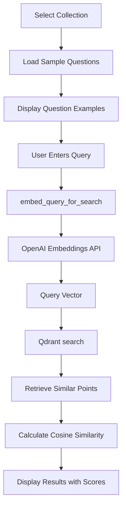

#### 主要パラメータ

| パラメータ | 説明 | デフォルト値 |
|-----------|------|-------------|
| `collection_name` | 検索対象コレクション | - |
| `query` | 検索クエリテキスト | - |
| `limit` | 取得する結果件数 | 10 |
| `score_threshold` | 類似度閾値（オプション） | なし |
| `embedding_model` | クエリ埋め込みモデル | text-embedding-3-small |

#### 検索結果構造

```python
{
    "id": 12345678901234,      # ポイントID
    "score": 0.89,             # コサイン類似度スコア
    "payload": {
        "question": "類似する質問",
        "answer": "対応する回答",
        "domain": "qa_cc_news",
        "source": "a02_qa_pairs_cc_news.csv",
        "created_at": "2024-11-26T12:00:00Z"
    }
}
```

#### 類似度スコアの解釈

| スコア範囲 | 解釈 |
|-----------|------|
| 0.90 - 1.00 | 非常に高い類似度 |
| 0.80 - 0.89 | 高い類似度 |
| 0.70 - 0.79 | 中程度の類似度 |
| 0.60 - 0.69 | 低い類似度 |
| 0.60 未満 | 関連性が低い |

---

## 7. 設定・依存関係

### 7.1 必須環境変数

| 変数名 | 説明 | 例 |
|--------|------|-----|
| `OPENAI_API_KEY` | OpenAI APIキー | `sk-...` |
| `QDRANT_URL` | QdrantサーバーURL（任意） | `http://localhost:6333` |

### 7.2 依存サービス

| サービス | 用途 | デフォルトURL | 起動コマンド |
|---------|------|--------------|-------------|
| **Qdrant** | ベクトルデータベース | `http://localhost:6333` | `docker-compose up -d` |
| **Redis** | Celeryブローカー | `redis://localhost:6379` | `redis-server` |
| **Celery** | 並列処理ワーカー | - | `./start_celery.sh restart -w 24` |
| **OpenAI API** | 埋め込み・Q/A生成 | `https://api.openai.com` | - |

### 7.3 主要な定数・設定値

```python
# qdrant_service.py
QDRANT_CONFIG = {
    "name": "Qdrant",
    "host": "localhost",
    "port": 6333,
    "url": "http://localhost:6333",
}

# 埋め込みモデル設定
COLLECTION_EMBEDDINGS_SEARCH = {
    "qa_corpus": {"model": "text-embedding-3-small", "dims": 1536},
    "qa_cc_news_a02_llm": {"model": "text-embedding-3-small", "dims": 1536},
    # ...
}

# バッチ処理設定
MAX_TOKENS_PER_REQUEST = 8000
BATCH_SIZE = 128
```

---

## 8. 使用方法

### 8.1 起動手順

```bash
# 1. Qdrantサーバー起動
docker-compose -f docker-compose/docker-compose.yml up -d

# 2. （Celery使用時）Redisクリア＆ワーカー起動
redis-cli FLUSHDB
./start_celery.sh restart -w 24

# 3. Streamlitアプリ起動
streamlit run rag_qa_pair_qdrant.py --server.port=8500

# 4. （任意）Flower監視
celery -A celery_config flower --port=5555
```

### 8.2 典型的なワークフロー

```
Step 1: 📥 RAGデータダウンロード
    └─ データセット選択 → ダウンロード → 前処理 → OUTPUT保存

Step 2: 🤖 Q/A生成
    └─ 前処理済みファイル選択 → パラメータ設定 → Q/A生成実行

Step 3: 🗄️ Qdrant登録（個別CSV操作）
    └─ Q/Aファイル選択 → コレクション設定 → ベクトル登録実行

Step 4: 🗄️ Qdrant登録（コレクション統合）【任意】
    └─ 複数コレクション選択 → 統合先名設定 → 統合実行

Step 5: 🔎 Qdrant検索
    └─ コレクション選択 → クエリ入力 → 検索実行 → 結果確認
```

### 8.3 トラブルシューティング

| 症状 | 原因 | 解決策 |
|------|------|--------|
| Qdrant接続エラー | Qdrantサーバー未起動 | `docker-compose up -d` |
| Q/A生成が進まない | Celeryワーカー未起動 | `./start_celery.sh restart` |
| OpenAI APIエラー | APIキー未設定 | `.env`に`OPENAI_API_KEY`設定 |
| メモリ不足 | 大量データ処理 | `max_docs`を減らす |
| タスクがPENDING | Redis接続問題 | `redis-cli FLUSHDB` |
| 埋め込み生成エラー | トークン数超過 | `max_tokens`を減らす |
| コレクション統合エラー | 選択コレクションが2未満 | 2つ以上のコレクションを選択 |

---

## 付録

### A. ファイル命名規則

**Q/Aペアファイル**:
```
{method}_qa_pairs_{dataset}.csv
  │                  │
  │                  └─ データセット名（cc_news, livedoor）
  └─ 生成方式（a02, a03, a10）
```

**前処理済みファイル**:
```
preprocessed_{dataset}_{timestamp}.csv
```

**統合コレクション**:
```
integration_{first_collection_name}
```

### B. 関連ドキュメント

- [doc/06_embedding_qdrant.md](./06_embedding_qdrant.md) - Embedding・Qdrant登録・検索詳細
- [doc/celery_tasks.md](./celery_tasks.md) - Celeryタスク詳細
- [doc/models.md](./models.md) - Pydanticモデル詳細
- [doc/helper_api.md](./helper_api.md) - OpenAI API詳細