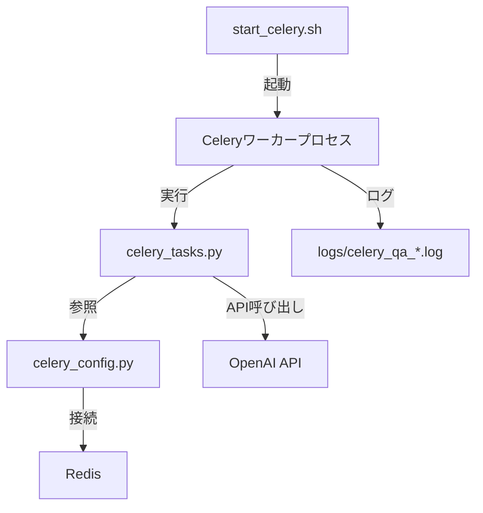

# Celeryワーカー管理システム - 完全ガイド

## 目次

1. [概要](#1-概要)
2. [ファイル構成と役割](#2-ファイル構成と役割)
3. [start_celery.sh 詳細](#3-start_celerysh-詳細)
4. [celery_config.py 設定](#4-celery_configpy-設定)
5. [celery_tasks.py タスク定義](#5-celery_taskspy-タスク定義)
6. [実行方法](#6-実行方法)
7. [トラブルシューティング](#7-トラブルシューティング)
8. [付録](#8-付録)

---

## 1. 概要

### システムの目的

Celeryワーカー管理システムは、Q/A生成タスクを非同期並列処理するための統合環境です。3つのコンポーネントが協調して動作します。

```
start_celery.sh  ←─ ワーカー起動・停止・監視
       ↓
celery_tasks.py  ←─ タスク定義とビジネスロジック
       ↓
celery_config.py ←─ Celery設定と最適化
```

### 主な特徴

- **✅ 自動ワーカー管理**: 起動・停止・再起動・ステータス確認
- **✅ Redis監視**: Redisサーバーの自動チェックと通知
- **✅ プロセス管理**: PIDファイルベースの安全な制御
- **✅ ログ管理**: ローテーション可能なログファイル
- **✅ 柔軟な設定**: ワーカー数・ログレベルを動的に変更可能

---

## 2. ファイル構成と役割

### 2.1 全体の関連図



### 2.2 各ファイルの役割

| ファイル | 役割 | 主な機能 |
|---------|------|---------|
| **start_celery.sh** | ワーカー管理スクリプト | 起動・停止・ステータス確認・再起動 |
| **celery_config.py** | Celery設定ファイル | タイムアウト・キュー・リトライ設定 |
| **celery_tasks.py** | タスク定義ファイル | Q/A生成タスクの実装 |

### 2.3 相互依存関係

```python
# start_celery.sh が celery_tasks.py を起動
celery -A celery_tasks worker ...

# celery_tasks.py が celery_config.py をインポート
from celery_config import app, OPENAI_CONFIG

# celery_config.py が環境変数から設定を読み込み
REDIS_URL = os.getenv('REDIS_URL', 'redis://localhost:6379/0')
```

---

## 3. start_celery.sh 詳細

### 3.1 基本構造

```bash
#!/bin/bash
# デフォルト設定
WORKERS=4           # ワーカー数
LOG_LEVEL="info"    # ログレベル
QUEUE_NAME="qa_generation"  # キュー名
```

### 3.2 主要コマンド

#### 起動
```bash
./start_celery.sh start -w 8
```

**処理フロー**:
1. Redis接続確認（`check_redis()`）
2. 既存ワーカー検出とクリーンアップ
3. Celeryワーカー起動（デタッチモード）
4. PIDファイル保存（`/tmp/celery_qa.pid`）

**実際の起動コマンド**:
```bash
celery -A celery_tasks worker \
    --loglevel=info \
    --concurrency=8 \
    --pool=prefork \
    --queues=qa_generation \
    --hostname=qa_worker@%h \
    --pidfile=/tmp/celery_qa.pid \
    --logfile=logs/celery_qa_%n.log \
    --detach
```

#### 停止
```bash
./start_celery.sh stop
```

**処理フロー**:
1. PIDファイルからプロセスID取得
2. TERM シグナル送信（グレースフルシャットダウン）
3. 2秒待機
4. 完全停止していない場合は KILL シグナル（強制終了）

#### ステータス確認
```bash
./start_celery.sh status
```

**表示内容**:
- Redis接続状態
- キュー長（待機中のタスク数）
- ワーカープロセスの状態
- アクティブタスク（`celery inspect active`）
- ワーカー統計（`celery inspect stats`）
- 最新ログ（tail -5）

#### 再起動
```bash
./start_celery.sh restart -w 8
```

**処理フロー**:
1. 既存ワーカーを停止
2. 2秒待機
3. Redisチェック
4. 新しいワーカーを起動

### 3.3 オプション

| オプション | 短縮形 | 説明 | デフォルト値 |
|-----------|-------|------|------------|
| `--workers` | `-w` | ワーカー数 | 4 |
| `--loglevel` | `-l` | ログレベル | info |
| `--help` | `-h` | ヘルプ表示 | - |

### 3.4 Redis自動チェック機能

```bash
check_redis() {
    if redis-cli ping > /dev/null 2>&1; then
        echo "✓ Redisサーバーが起動しています"
        return 0
    else
        echo "✗ Redisサーバーが起動していません"
        echo "以下のコマンドでRedisを起動してください："
        echo "  brew services start redis  # macOS"
        echo "  sudo systemctl start redis  # Linux"
        return 1
    fi
}
```

### 3.5 プロセスクリーンアップ機能

```bash
cleanup_workers() {
    # 古いPIDファイルを削除
    if [ -f /tmp/celery_qa.pid ]; then
        rm -f /tmp/celery_qa.pid
    fi

    # 全てのCeleryワーカープロセスを強制終了
    pkill -9 -f "celery.*worker" 2>/dev/null
    sleep 1
}
```

---

## 4. celery_config.py 設定

### 4.1 基本設定

```python
class CeleryConfig:
    # ブローカー設定（Redis）
    broker_url = 'redis://localhost:6379/0'
    result_backend = 'redis://localhost:6379/0'

    # シリアライザー設定
    task_serializer = 'json'
    accept_content = ['json']
    result_serializer = 'json'
```

### 4.2 ワーカー設定

```python
# 並列度
worker_prefetch_multiplier = 1  # 各ワーカーが一度に取得するタスク数

# メモリリーク対策
worker_max_tasks_per_child = 50  # 50タスク後にワーカー再起動

# タスク完了後にACK
task_acks_late = True
task_reject_on_worker_lost = True
```

**重要**: `worker_prefetch_multiplier = 1` により、各ワーカーは1タスクずつ処理します。これにより負荷分散が改善されます。

### 4.3 タイムアウト設定

```python
task_time_limit = 300        # 5分でタイムアウト（ハードリミット）
task_soft_time_limit = 270   # 4.5分でソフトタイムアウト
```

**関連**: `start_celery.sh`の`--concurrency`オプションと連動します。

### 4.4 キュー設定

```python
# キュー定義
task_queues = (
    Queue('high_priority', Exchange('high_priority'), routing_key='high'),
    Queue('normal_priority', Exchange('normal_priority'), routing_key='normal'),
    Queue('low_priority', Exchange('low_priority'), routing_key='low'),
)

# タスクルーティング
task_routes = {
    'tasks.process_chunk_task': 'high_priority',
    'tasks.process_batch_task': 'normal_priority',
    'tasks.aggregate_results_task': 'low_priority',
}
```

**注意**: 現在のシステムは`qa_generation`キューのみを使用しています。将来的に優先度別の処理を実装する際に使用します。

### 4.5 リトライ設定

```python
task_autoretry_for = (Exception,)  # 全ての例外でリトライ
task_retry_kwargs = {
    'max_retries': 3,      # 最大3回
    'countdown': 60,       # 60秒後にリトライ
    'retry_jitter': True,  # ランダム遅延追加
}
```

**連携**: `celery_tasks.py`の`@app.task(bind=True, max_retries=3)`と連動します。

### 4.6 OpenAI API設定

```python
OPENAI_CONFIG = {
    'api_key': os.getenv('OPENAI_API_KEY'),
    'models': {
        'gpt-5-mini': {
            'rpm_limit': 3500,   # Requests Per Minute
            'tpm_limit': 200000, # Tokens Per Minute
            'max_retries': 3,
            'retry_delay': 60
        },
        'gpt-4o-mini': {
            'rpm_limit': 500,
            'tpm_limit': 200000,
            'max_retries': 3,
            'retry_delay': 60
        }
    }
}
```

**使用箇所**: `celery_tasks.py:generate_qa_for_chunk_async()`でモデル別のレート制限を実装可能です。

---

## 5. celery_tasks.py タスク定義

### 5.1 主要タスク

#### generate_qa_for_batch_async
```python
@app.task(bind=True, max_retries=3, queue='qa_generation')
def generate_qa_for_batch_async(self, chunks, config, model):
    """複数チャンクのバッチ処理タスク"""
    try:
        # バッチ処理でQ/A生成
        qa_pairs = generate_qa_pairs_for_batch(chunks, config, model, client)
        return qa_pairs
    except Exception as e:
        if self.request.retries < self.max_retries:
            raise self.retry(exc=e, countdown=5 * (self.request.retries + 1))
```

**設定との連携**:
- `max_retries=3`: `celery_config.py:task_retry_kwargs['max_retries']`と同期
- `queue='qa_generation'`: `start_celery.sh:QUEUE_NAME`と同期
- `countdown=5 * (retries + 1)`: 指数バックオフ（5秒、10秒、15秒）

#### generate_qa_for_chunk_async
```python
@app.task(bind=True, max_retries=3, queue='qa_generation')
def generate_qa_for_chunk_async(self, chunk_data, config, model):
    """単一チャンク処理タスク"""
    # 同様の実装
```

### 5.2 タスク投入関数

```python
def submit_parallel_qa_generation(chunks, config, model, batch_size=3):
    """Celeryタスクを投入"""
    tasks = []
    for i in range(0, len(chunks), batch_size):
        batch = chunks[i:i+batch_size]
        task = generate_qa_for_batch_async.delay(batch, config, model)
        tasks.append(task)
    return tasks
```

### 5.3 結果収集関数

```python
def collect_results(tasks, timeout=600):
    """タスク結果を収集（進捗表示付き）"""
    qa_pairs = []
    for i, task in enumerate(tasks):
        try:
            result = task.get(timeout=timeout)
            qa_pairs.extend(result)
        except Exception as e:
            logger.error(f"タスク {i} 失敗: {e}")
    return qa_pairs
```

---

## 6. 実行方法

### 6.1 環境準備

```bash
# 1. Redisを起動
brew services start redis  # macOS
# または
redis-server  # 手動起動

# 2. logsディレクトリを作成
mkdir -p logs

# 3. 環境変数を設定
export OPENAI_API_KEY="your-api-key"
export REDIS_URL="redis://localhost:6379/0"
```

### 6.2 基本的な使い方

#### ワーカー起動
```bash
# デフォルト（4ワーカー）
./start_celery.sh start

# 8ワーカーで起動
./start_celery.sh start -w 8

# デバッグログレベルで起動
./start_celery.sh start -w 4 -l debug
```

#### ステータス確認
```bash
./start_celery.sh status

# 出力例:
# === Celeryワーカー ステータス ===
# Redis: ✓ 起動中
# キュー長: 0
# ワーカー: ✓ 起動中
# qa_worker@hostname: OK
```

#### ワーカー停止
```bash
./start_celery.sh stop
```

#### ワーカー再起動
```bash
./start_celery.sh restart -w 8
```

### 6.3 推奨ワークフロー

#### 初回起動時
```bash
# 1. Redisをクリア（古いタスクを削除）
redis-cli FLUSHDB

# 2. ワーカーを起動
./start_celery.sh start -w 8

# 3. ステータス確認
./start_celery.sh status
```

#### 設定変更後
```bash
# celery_config.pyやcelery_tasks.pyを変更した場合
./start_celery.sh restart -w 8
```

#### 問題が発生した場合
```bash
# 1. ワーカーを停止
./start_celery.sh stop

# 2. 全てのプロセスをクリーンアップ
pkill -9 -f "celery.*worker"

# 3. PIDファイルを削除
rm -f /tmp/celery_qa.pid

# 4. Redisをクリア
redis-cli FLUSHDB

# 5. 再起動
./start_celery.sh start -w 8
```

---

## 7. トラブルシューティング

### 7.1 ワーカーが起動しない

**症状**: `./start_celery.sh start`が失敗する

**診断手順**:
```bash
# 1. Redisの状態確認
redis-cli ping
# 期待される出力: PONG

# 2. Redisを起動
brew services start redis

# 3. celery_tasks.pyの構文エラー確認
python -m py_compile celery_tasks.py

# 4. ログを確認
tail -f logs/celery_qa_*.log
```

**よくある原因**:
- Redisが起動していない
- `celery_tasks.py`に構文エラーがある
- `OPENAI_API_KEY`が設定されていない

### 7.2 タスクが処理されない

**症状**: タスクを投入しても処理が進まない

**診断**:
```bash
# キューの状態確認
redis-cli LLEN celery
redis-cli LLEN qa_generation

# ワーカーのアクティブタスク確認
celery -A celery_tasks inspect active
```

**解決策**:
```bash
# ワーカーを再起動
./start_celery.sh restart -w 8

# それでも解決しない場合
redis-cli FLUSHDB
./start_celery.sh restart -w 8
```

### 7.3 メモリリーク

**症状**: ワーカープロセスのメモリ使用量が増加し続ける

**対策**:
```python
# celery_config.py で設定
worker_max_tasks_per_child = 50  # 50タスク後にワーカー再起動
```

**手動対処**:
```bash
# ワーカーを定期的に再起動
./start_celery.sh restart -w 8
```

### 7.4 タイムアウトエラー

**症状**: `task_time_limit exceeded`

**診断**:
```bash
# ログを確認
tail -100 logs/celery_qa_*.log | grep -i timeout
```

**解決策**:
```python
# celery_config.py でタイムアウトを延長
task_time_limit = 600        # 10分に延長
task_soft_time_limit = 540   # 9分に延長
```

```bash
# ワーカーを再起動
./start_celery.sh restart -w 8
```

### 7.5 PIDファイルの問題

**症状**: `./start_celery.sh stop`が動作しない

**診断**:
```bash
# PIDファイルの存在確認
cat /tmp/celery_qa.pid

# プロセスの存在確認
ps aux | grep celery
```

**解決策**:
```bash
# PIDファイルを削除
rm -f /tmp/celery_qa.pid

# 全てのCeleryプロセスを強制終了
pkill -9 -f "celery.*worker"

# 再起動
./start_celery.sh start -w 8
```

---

## 8. 付録

### 8.1 ワーカー数の最適化

| CPU数 | 推奨ワーカー数 | 理由 |
|-------|--------------|------|
| 4コア | 4-8 | CPU数×1-2倍 |
| 8コア | 8-16 | CPU数×1-2倍 |
| 16コア | 16-32 | CPU数×1-2倍 |

**注意**: OpenAI APIのレート制限を考慮してください。

### 8.2 ログファイルの管理

```bash
# ログローテーション（手動）
mv logs/celery_qa_qa_worker.log logs/celery_qa_qa_worker.log.$(date +%Y%m%d)
./start_celery.sh restart -w 8

# ログの圧縮
gzip logs/celery_qa_*.log.*

# 古いログの削除（30日以上前）
find logs/ -name "celery_qa_*.log.*.gz" -mtime +30 -delete
```

### 8.3 環境変数の一覧

| 変数名 | 説明 | デフォルト値 |
|-------|------|------------|
| `REDIS_URL` | RedisサーバーURL | `redis://localhost:6379/0` |
| `OPENAI_API_KEY` | OpenAI APIキー | （必須） |
| `CELERY_BROKER_URL` | Celeryブローカー | `REDIS_URL`と同じ |

### 8.4 設定変更のチェックリスト

#### celery_config.py を変更した場合
- [ ] 構文エラーがないか確認: `python celery_config.py`
- [ ] ワーカーを再起動: `./start_celery.sh restart -w 8`
- [ ] ログを確認: `tail -f logs/celery_qa_*.log`

#### celery_tasks.py を変更した場合
- [ ] 構文エラーがないか確認: `python -m py_compile celery_tasks.py`
- [ ] インポートエラーがないか確認: `python -c "import celery_tasks"`
- [ ] ワーカーを再起動: `./start_celery.sh restart -w 8`
- [ ] テストタスクを投入して動作確認

#### start_celery.sh を変更した場合
- [ ] 実行権限を確認: `chmod +x start_celery.sh`
- [ ] 構文エラーがないか確認: `bash -n start_celery.sh`
- [ ] テスト実行: `./start_celery.sh status`

### 8.5 パフォーマンスチューニング

#### ワーカー設定の最適化
```python
# celery_config.py
worker_prefetch_multiplier = 1      # 低いほど負荷分散が改善
worker_max_tasks_per_child = 50     # メモリリーク対策
```

#### タイムアウトの最適化
```python
# 長時間タスク向け
task_time_limit = 600        # 10分
task_soft_time_limit = 540   # 9分

# 短時間タスク向け
task_time_limit = 180        # 3分
task_soft_time_limit = 150   # 2.5分
```

#### Redis接続の最適化
```python
# celery_config.py
broker_connection_retry_on_startup = True
broker_connection_max_retries = 10
```

### 8.6 監視とアラート

#### 基本的な監視コマンド
```bash
# リアルタイム監視
watch -n 5 './start_celery.sh status'

# キュー長の監視
watch -n 1 'redis-cli LLEN celery'

# メモリ使用量の監視
watch -n 5 'ps aux | grep celery | grep -v grep'
```

#### アラートスクリプト例
```bash
#!/bin/bash
# celery_monitor.sh

QUEUE_LENGTH=$(redis-cli LLEN celery)

if [ $QUEUE_LENGTH -gt 100 ]; then
    echo "警告: キュー長が100を超えています ($QUEUE_LENGTH)"
    # 通知処理（メール、Slack等）
fi

if ! pgrep -f "celery.*worker" > /dev/null; then
    echo "エラー: Celeryワーカーが起動していません"
    # 自動再起動
    ./start_celery.sh start -w 8
fi
```

---

## まとめ

Celeryワーカー管理システムは、3つのコンポーネントが協調して動作します:

1. **start_celery.sh**: ワーカーの起動・停止・監視
2. **celery_config.py**: Celeryの設定と最適化
3. **celery_tasks.py**: タスクの定義と実装

### 推奨ワークフロー

```bash
# 1. 環境準備
brew services start redis
export OPENAI_API_KEY="your-key"

# 2. ワーカー起動
redis-cli FLUSHDB
./start_celery.sh start -w 8

# 3. ステータス確認
./start_celery.sh status

# 4. Q/A生成実行
python a02_make_qa_para.py --dataset cc_news --use-celery --celery-workers 8

# 5. 完了後にワーカー停止
./start_celery.sh stop
```

### トラブル時の対処

```bash
# フルリセット
./start_celery.sh stop
pkill -9 -f "celery.*worker"
rm -f /tmp/celery_qa.pid
redis-cli FLUSHDB
./start_celery.sh start -w 8
```

詳細な問題については、各セクションのトラブルシューティングを参照してください。